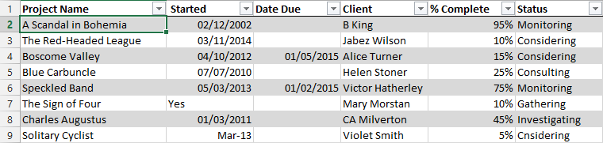
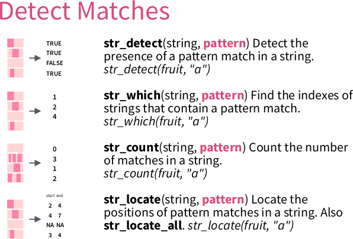
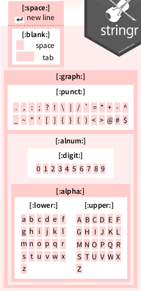
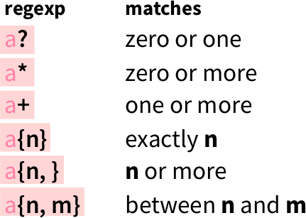
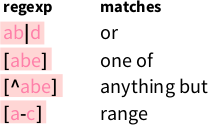
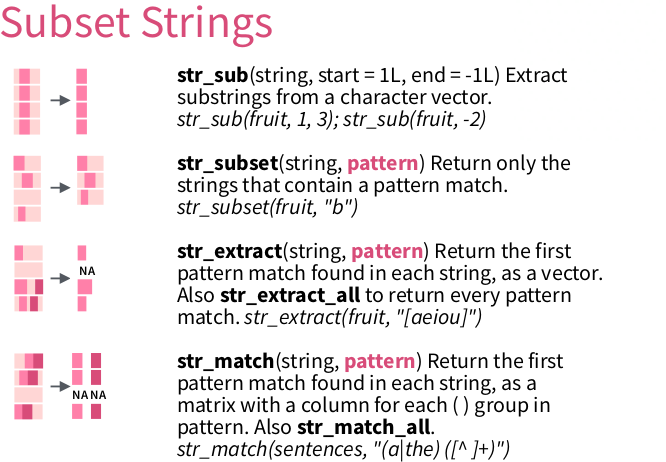
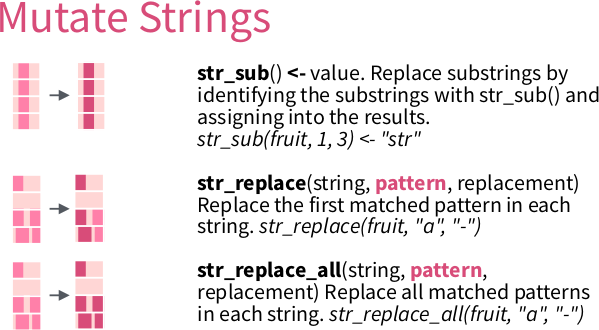

# Regular expressions and `testthat`

Richèl J.C. Bilderbeek

## Introduction


> 'Regular expressions' from https://xkcd.com/208

### Goal

In this chapter, you will learn:

 * How to express your ideas as a regular expression
 * Verify that you indeed did so

### Why is this important?

Knowing the basics of regular expressions, prevents you having
to hand-craft functions to detect patterns in any text.

Being able to verify your own assumptions allows you to speed
up any development of any code. It is estimated that 50-90%
of all the time, we are debugging our code. Being good at
testing, is the way to become faster.

### What are regular expressions?

A regular expression 'is a sequence of characters that define a
search pattern'. Such a pattern may be a zip code, a date,
or any other text of which you can say: 'this is not just text,
it is a [something]'.

For example, take a Dutch zip code: `9747 AG`. Dutch zip
code have four digits, a space and then two uppercase
alphabet characters.

A regex for this is `[:digit:]{4} [:upper:]{2}`.

### Applications

DNA data:

```
>KU215420.1|Felinecoronavirus|Feliscatus|Belgium|2013|Envelope
ATGATGTTTCCTAGGGCATTTACTATCATAGATGACCATGGTATGGTTGTTAGTGTCTTC
>KP143511.1|Felinecoronavirus|Feliscatus|UnitedKingdom|2013|Envelope
ATGATGTTTCCTAGGGCATTTACTATCATAGACGACCATGGTATGGTTGTTAGTGTCTTC
```

Protein data:

```
>sp|P0DTC2|SPIKE_SARS2 Spike glycoprotein OS=Severe acute respiratory syndrome coronavirus 2 OX=2697049 GN=S PE=1 SV=1
MFVFLVLLPLVSSQCVNLTTRTQLPPAYTNSFTRGVYYPDKVFRSSVLHSTQDLFLPFFS
>sp|P0DTC5|VME1_SARS2 Membrane protein OS=Severe acute respiratory syndrome coronavirus 2 OX=2697049 PE=3 SV=1
MADSNGTITVEELKKLLEQWNLVIGFLFLTWICLLQFAYANRNRFLYIIKLIFLWLLWPV
```

Most messy Excel sheets :-)



### Using regexes in R


> The 'stringr' logo. 'stringr' is part of the Tidyverse

Multiple R functions to work with regular expressions:

 * `stringr::str_`
 * `egrep`, `grepl`, `gsub`

```{r}
library(stringr)
```

### Dangers of regexes


> 'Perl problems', from https://xkcd.com/1171/

Regexes have different dialects, such as POSIX and perl.
Within R, there are the base R dialect and the Tidyverse dialect.

We'll have to test!

## Testing


> From George Dinwiddie's blog, http://blog.gdinwiddie.com/2012/12/26/tdd-hat/

### Why test?

 * To be sure your code is correct
 * Spend less time fixing bugs
 * Unit of communication
 * Clean software interface

### Our first test

The `testthat` package is the Tidyverse package to write tests.

```{r}
library(testthat)
```

All test functions start with `expect_`, for example:

```{r}
expect_true(1 + 1 == 2)
expect_false("cat" == "dog")
expect_equal(1 + 1, 2)
```

If a test fails:

```{r error=TRUE}
expect_equal(1 + 1, 3)
```

## Detect a full match

Here, we will detect simple patterns using `str_which`.

Tip: run `?str_which` for its documentation.



> From 'Work with Strings Cheatsheet', https://rstudio.com/resources/cheatsheets


### `str_which` demo

```{r}
fruit <- c("apple", "banana", "pinapple")
expect_equal(str_which(fruit, "banana"), 2)
expect_equal(str_which(fruit, "apple"), c(1, 3))
expect_equal(str_which(fruit, "submarine"), integer(0))
```

### Example exercise: `has_a_one`

Write a function called `has_a_one` that detects if a character
vector contains at least one one.

To be precise: 'a one' is a string that starts with a `1`, then ends directly.

These tests must pass:

```
expect_true(has_a_one("1"))
expect_true(has_a_one(c("X", "1")))
expect_true(has_a_one(c("1", "1")))
expect_false(has_a_one("X"))
expect_false(has_a_one("11"))
expect_false(has_a_one("1 1"))
expect_false(has_a_one(integer(0)))
expect_false(has_a_one(NULL))
expect_false(has_a_one(NA))
```

Use the anchors as shown on the cheatsheet to specify that
the complete string, from begin to the end, must consist out of characters


> From 'Work with Strings Cheatsheet', https://rstudio.com/resources/cheatsheets

Here is a stub of the function, but feel free to use your own function body:

```{r}
has_a_one <- function(text) {
  length(stringr::str_which(text, "your regex here")) >= 1
}
```

#### Answer `has_a_one`

```{r}
has_a_one <- function(text) {
  length(stringr::str_which(text, "^1$")) >= 1
}
```

Note that you may have had a different regex.
No worries: if all tests pass, you did a great job!

```{r}
expect_true(has_a_one("1"))
expect_true(has_a_one(c("X", "1")))
expect_true(has_a_one(c("1", "1")))
expect_false(has_a_one("X"))
expect_false(has_a_one("11"))
expect_false(has_a_one("1 1"))
expect_false(has_a_one(integer(0)))
expect_false(has_a_one(NULL))
expect_false(has_a_one(NA))
```

Also, using another `stringr` function, such as `str_count`, `str_subset`
or `str_match` are all valid as well. It just made the code longer.
Also here: if all tests pass, you did a great job!

### Exercise: `has_a_digit`

Write a function called `has_a_digit` that detects if a 
character vector contains at least one digit. To be precise, 'a digit' is a string that starts with a (decimal) digit, the ends directly.

These tests must pass:

```
expect_true(has_a_digit("0"))
expect_true(has_a_digit("1"))
expect_true(has_a_digit(c("1", "2")))
expect_true(has_a_digit(c("X", "1")))
expect_false(has_a_digit(""))
expect_false(has_a_digit("12"))
expect_false(has_a_digit("1 2"))
expect_false(has_a_digit("X"))
expect_false(has_a_digit(character(0)))
expect_false(has_a_digit(NULL))
expect_false(has_a_digit(NA))
```

Use the regex pattern as shown on the cheatsheet to specify a digit:



> From 'Work with Strings Cheatsheet', https://rstudio.com/resources/cheatsheets

Here is a stub of the function, but feel free to use your own function body:

```{r}
has_a_digit <- function(text) {
  length(stringr::str_which(text, "your regex here")) >= 1
}
```

#### Answer: `has_a_digit`

```{r}
has_a_digit <- function(text) {
  length(stringr::str_which(text, "^[:digit:]$")) >= 1
}
```

```{r}
expect_true(has_a_digit("0"))
expect_true(has_a_digit("1"))
expect_true(has_a_digit(c("1", "2")))
expect_true(has_a_digit(c("X", "1")))
expect_false(has_a_digit(""))
expect_false(has_a_digit("12"))
expect_false(has_a_digit("1 2"))
expect_false(has_a_digit("X"))
expect_false(has_a_digit(character(0)))
expect_false(has_a_digit(NULL))
expect_false(has_a_digit(NA))
```

### Exercise: `has_a_word`

Write a function called `has_a_word` that detects if a string is a word. To be precise (and to simplify), 'a word' starts with one or more lowercase characters, then ends directly.

These tests must pass:

```
expect_true(has_a_word("a"))
expect_true(has_a_word("an"))
expect_true(has_a_word("apple"))
expect_true(has_a_word(c("an", "apple")))
expect_true(has_a_word(c("", "apple")))
expect_false(has_a_word("."))
expect_false(has_a_word("X"))
expect_false(has_a_word("hI"))
expect_false(has_a_word("an apple"))
expect_false(has_a_word(character(0)))
expect_false(has_a_word(NULL))
expect_false(has_a_word(NA))
```

Use the quantifiers as shown on the cheatsheet to specify that one needs
one or more characters:



> From 'Work with Strings Cheatsheet', https://rstudio.com/resources/cheatsheets

Here is a stub of the function, but feel free to use your own function body:

```{r}
has_a_word <- function(text) {
  length(stringr::str_which(text, "your regex here")) >= 1
}
```

#### Answer: `has_a_word`

```{r}
has_a_word <- function(text) {
  length(stringr::str_which(text, "^[:lower:]+$")) >= 1
}
```

```{r}
expect_true(has_a_word("a"))
expect_true(has_a_word("an"))
expect_true(has_a_word("apple"))
expect_true(has_a_word(c("an", "apple")))
expect_true(has_a_word(c("", "apple")))
expect_false(has_a_word("."))
expect_false(has_a_word("X"))
expect_false(has_a_word("hI"))
expect_false(has_a_word("an apple"))
expect_false(has_a_word(character(0)))
expect_false(has_a_word(NULL))
expect_false(has_a_word(NA))
```

### Exercise: `has_dna_seq` (alternates)

Write a function called `has_dna_seq` that detects if a character
vector contains one or more DNA sequences. 
To be precise, 'a DNA sequence' starts with one or more
nucleotides (an 'A', 'C', 'G' or 'T'), then ends directly. 

These tests must pass:

```
expect_true(has_dna_seq("A"))
expect_true(has_dna_seq(c("A", "CGT")))
expect_true(has_dna_seq(c("", "CGT")))
expect_false(has_dna_seq("Ax"))
expect_false(has_dna_seq("A C"))
expect_false(has_dna_seq(character(0)))
expect_false(has_dna_seq(NULL))
expect_false(has_dna_seq(NA))
```

Use the alternates as shown on the cheatsheet to specify that
each character must be one of the four nucleotides:



> From 'Work with Strings Cheatsheet', https://rstudio.com/resources/cheatsheets

Here is a stub of the function, but feel free to use your own function body:

```{r}
has_dna_seq <- function(text) {
  length(stringr::str_which(text, "your regex here")) >= 1
}
```

#### Answer: `has_dna_seq`

```{r}
has_dna_seq <- function(text) {
  length(stringr::str_which(text, "^[ACGT]+$")) >= 1
}
```

```{r}
expect_true(has_dna_seq("A"))
expect_true(has_dna_seq(c("A", "CGT")))
expect_true(has_dna_seq(c("", "CGT")))
expect_false(has_dna_seq("Ax"))
expect_false(has_dna_seq("A C"))
expect_false(has_dna_seq(character(0)))
expect_false(has_dna_seq(NULL))
expect_false(has_dna_seq(NA))
```

## Extract a pattern for one submatch

Here, we will extract a pattern using `str_match`.

Tip: run `?str_match` for its documentation.



> From 'Work with Strings Cheatsheet', https://rstudio.com/resources/cheatsheets

### `str_match`

`str_match` allows to extract multiple matches at once:

```{r}
text <- c(
  "2020/03/14",
  "not a date",
  "2020/07/22"
)
str_match(
  text, "([:digit:]{4})/([:digit:]{2})/([:digit:]{2})"
)
```

### Context

Here we will work on a DNA sequence:

```{r}
library(readr)
text <- read_lines("data/virus.fas")
head(text, n = 10)
```

The data encoded in this text:

```
>[DNA sequence number]|[virus name]|[host species name]|[country of host]|[year]|[protein name]"
[DNA sequence]
```

We know that there are 30 sequences and 180 lines in that file:

```{r}
n_sequences <- 30
n_lines <- 180
```


### Extract a character vector from a submatch

Using a pattern that is specific for the DNA sequence descriptors,
we get matched strings and NAs:

```{r str_match_sequence_descriptor_lines}
matches <- str_match(text, ">.*")
expect_is(matches, "matrix")
expect_equal(nrow(matches), n_lines)
expect_equal(ncol(matches), 1)
head(matches, n = 8)
```

Using round brackets, the matrix gives one extra column per sub-match.
Here, we select for all info after the `>`:

```{r str_match_sequence_descriptor_as_column}
matches <- str_match(text, ">(.*)")
expect_is(matches, "matrix")
expect_equal(nrow(matches), n_lines)
expect_equal(ncol(matches), 2)
head(matches, n = 8)
```

After select the second column, we get rid of the `NAs` using `na.omit` 
and converting to a character vector:

```{r str_match_remove_na}
matches <- as.character(na.omit(matches[, 2]))
expect_is(matches, "character")
expect_equal(length(matches), n_sequences)
head(matches)
```

All of this in one go:

```{r str_match_all_at_once}
matches <- as.character(
  na.omit(
    str_match(text, ">(.*)")[, 2]
  )
)
expect_equal(length(matches), n_sequences)
head(matches)
```

### Example exercise: `extract_dna_seq_numbers` (1 submatch)

Extract the DNA sequence numbers.

These tests must pass:

```
dna_seq_numbers <- extract_dna_seq_numbers(text)
expect_equal(n_sequences, length(dna_seq_numbers))
expect_equal("KX722530.1", dna_seq_numbers[1])
expect_equal("KP143511.1", dna_seq_numbers[30])
```

Here is a stub of the function, but feel free to use your own function body:

```{r}
extract_dna_seq_numbers <- function(text) {
  as.character(
    na.omit(
      str_match(text, "your regex here")[, 2]
    )
  )
}
```

Note that the `[, 2]` denotes the second column. It can be another column as well

Hint:

 * it is the text between `>` and `|Felinecoronavirus`.
 * Use `\\|` in your regex to indicate you want the pipe character (
   as `a|b` is the regex for 'a or b')

### Answer: `extract_dna_seq_numbers`

```{r}
extract_dna_seq_numbers <- function(text) {
  as.character(
    na.omit(
      str_match(text, ">(.*)\\|Felinecoronavirus.*")[, 2]
    )
  )
}
```

```{r}
dna_seq_numbers <- extract_dna_seq_numbers(text)
expect_equal(n_sequences, length(dna_seq_numbers))
expect_equal("KX722530.1", dna_seq_numbers[1])
expect_equal("KP143511.1", dna_seq_numbers[30])
```

The regex `">(.*)\\|.*"` would not work, because the asterisk is *greedy*.

## Extract a pattern for multiple submatches

### Context

Here we will work on a proteome:

```{r}
text <- read_lines("data/UP000464024.fasta")
head(text, n = 7)
```

The data encoded in this text:

```
>sp|[Sequence ID]|[Protein ID] [Protein description] OS=[Virus name] OX=[OX] GN=[GN] PE=[PE] SV=[SV]
[Peptide sequence]
```

We will only look at `[Sequence ID]` and `[Protein ID]`.

We know that:

```{r}
n_proteins <- 13
```


### Exercise: `extract_prot_and_seq_ids`

Extract all proteins' ID and sequence ID, in a tibble.

```{r}
library(tibble)
```

These tests must pass:

```
t <- extract_prot_and_seq_ids(text)
expect_true(is_tibble(t))
expect_equal(n_proteins, nrow(t))
expect_equal(2, ncol(t))
expect_equal(colnames(t), c("seq_id", "prot_id"))
expect_equal(t$seq_id[1], "P0DTC7")
expect_equal(t$prot_id[1], "NS7A_SARS2")
expect_equal(t$seq_id[13], "P0DTC5")
expect_equal(t$prot_id[13], "VME1_SARS2")
```

Here is a stub of the function, but feel free to use your own function body:

```{r}
extract_prot_and_seq_ids <- function(text) {
  matrix <- na.omit(
    str_match(
      text,
      "your regex here"
    )[, c(2, 3)]
  )
  colnames(matrix) <- c("seq_id", "prot_id")
  tibble::as_tibble(matrix)
}
```

### Answer: `extract_prot_and_seq_ids`

```{r}
extract_prot_and_seq_ids <- function(text) {
  matrix <- na.omit(
    str_match(text,
      ">sp\\|([:graph:]+)\\|([:graph:]+) ")[, c(2, 3)]
  )
  colnames(matrix) <- c("seq_id", "prot_id")
  tibble::as_tibble(matrix)
}
```

```{r}
t <- extract_prot_and_seq_ids(text)
expect_true(is_tibble(t))
expect_equal(n_proteins, nrow(t))
expect_equal(2, ncol(t))
expect_equal(colnames(t), c("seq_id", "prot_id"))
expect_equal(t$seq_id[1], "P0DTC7")
expect_equal(t$prot_id[1], "NS7A_SARS2")
expect_equal(t$seq_id[13], "P0DTC5")
expect_equal(t$prot_id[13], "VME1_SARS2")
```

## Mutate



> From 'Work with Strings Cheatsheet', https://rstudio.com/resources/cheatsheets

```{r}
s <- "UnitedKingdom"
t <- str_replace(
  s,
  "([:upper:][:lower:]+)([:upper:][:lower:]+)",
  "\\1 \\2"
)
expect_equal("United Kingdom", t)
```

## Test for match

You may want to test if a function's output matches
a pattern:

```{r}
#' Get the version, for example '1.0'
get_version <- function() {
  sample(c("1.0", "1.1"), size = 1)
}
```

Using `testthat::expect_match` gives an unexpected result:

```{r error=TRUE}
expect_match(get_version(), "1\\.[:digit:]")
```

Take a look at `?testthat::expect_match`:

> Details
>
> expect_match() is a wrapper around grepl().
> See its documentation for more detail about the individual arguments.

Use the base R regex dialect:

```{r}
expect_match(get_version(), "1\\.[[:digit:]]")
```

## Bigger picture

### Develop in packages

 * Also when 'just' doing data analysis
 * Cleanly read files
 * Test you regexes

### Regex usage outside R

There are plenty of tools that allow to use regular expressions:

 * `grep`, `egrep`
 * `sed`
 * `dir`/`ls`

### Warning


> 'Regex Golf', from https://xkcd.com/1313/

Don't overthink your regexes! If all tests pass, you did a good job

## Resources

 * [RStudio cheatsheets](https://rstudio.com/resources/cheatsheets/),
   including the 'Work with Strings Cheatsheet'
