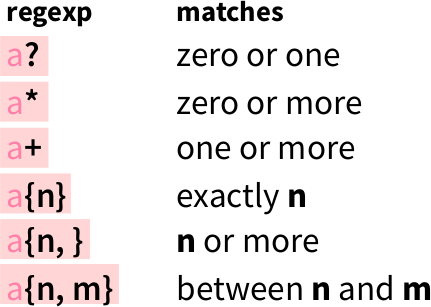

--- 
knit: "bookdown::render_book"
title: "TRES Tidyverse Tutorial"
author: "Raphael, Pratik, Theo and Richèl"
date: "`r Sys.Date()`"
site: bookdown::bookdown_site
output: bookdown::gitbook
documentclass: book
# bibliography: [refs.bib]
biblio-style: apalike
link-citations: yes
github-repo: pratikunterwegs/tres-tidy-tutorial
description: "TRES Tidyverse Tutorial"
---
```{r include=FALSE, cache=FALSE}
knitr::opts_knit$set(root.dir = here::here())
set.seed(1)
options(digits = 3)

knitr::opts_chunk$set(
  comment = "#>",
  collapse = TRUE,
  cache = FALSE,
  warning = FALSE,
  error = FALSE,
  message = FALSE,
  out.width = "\\textwidth", 
  fig.align = "center",
  fig.width = 7,
  fig.asp = 0.618,  # 1 / phi
  fig.show = "hold"
)
options(knitr.kable.NA = "")
options(dplyr.print_min = 6, dplyr.print_max = 6)
```

# Outline {-}

This is the readable version of the TRES [tidyverse](https://www.tidyverse.org/) tutorial. A convenient PDF version can be downloaded by clicking the PDF document icon in the header bar.

## About {-}

The TRES tidyverse tutorial is an online workshop on how to use the tidyverse, a set of packages in the R computing language designed at making data handling and plotting easier. 

This tutorial will take the form of a one hour per week video stream via Google Meet, every Friday morning at 10.00 (Groningen time) starting from the 29th of May, 2020 and lasting for a couple of weeks (depending on the number of topics we want to cover, but there should be at least 5). 

**PhD students from outside our department are welcome to attend.**

## Schedule {-}

Topic|Package|Instructor|Date*
-----|---|---|---
Reading data and string manipulation|[readr](https://readr.tidyverse.org/), [stringr](https://stringr.tidyverse.org/), [glue](https://github.com/tidyverse/glue)|Pratik|29/05/20
Data and reshaping|[tibble](https://tibble.tidyverse.org/), [tidyr](https://tidyr.tidyverse.org/)|Raphael|05/06/20
Manipulating data|[dplyr](https://dplyr.tidyverse.org/)|Theo|12/06/20
Working with lists and iteration|[purrr](https://purrr.tidyverse.org/)|Pratik|19/06/20
Plotting|[ggplot2](https://ggplot2.tidyverse.org/)|Raphael|26/06/20
Regular expressions|[regex](https://stat.ethz.ch/R-manual/R-devel/library/base/html/regex.html)|Richel|17/07/20
Programming with the tidyverse|[rlang](https://rlang.r-lib.org/)|Pratik|10/07/20

## Possible extras {-}

- Reproducibility and package-making (with e.g. [usethis](https://usethis.r-lib.org/))  
- Embedding C++ code with [Rcpp](http://adv-r.had.co.nz/Rcpp.html)

## Join {-}

Join the Slack [by clicking this link (Slack account required)](https://join.slack.com/t/trestidytorial/shared_invite/zt-ejgr3tow-3zisGwPg1JDeTJD33DWb2A).

*Tentative dates.

<!--chapter:end:index.rmd-->

---
editor_options:
  chunk_output_type: console
---
```{r include=FALSE, cache=FALSE}
knitr::opts_knit$set(root.dir = here::here())
set.seed(1)
options(digits = 3)

knitr::opts_chunk$set(
  comment = "#>",
  collapse = TRUE,
  cache = FALSE,
  warning = FALSE,
  error = FALSE,
  message = FALSE,
  out.width = "\\textwidth", 
  fig.align = "center",
  fig.width = 7,
  fig.asp = 0.618,  # 1 / phi
  fig.show = "hold"
)
options(knitr.kable.NA = "")
options(dplyr.print_min = 6, dplyr.print_max = 6)
```

# Reading files and string manipulation


Load the packages for the day.

```{r load_packages_01}
library(readr)
library(stringr)
library(glue)
```

## Data import and export with `readr`

Data in the wild with which ecologists and evolutionary biologists deal is most often in the form of a text file, usually with the extensions `.csv` or `.txt`. Often, such data has to be written to file from within `R`. `readr` contains a number of functions to help with reading and writing text files.

### Reading data

Reading in a csv file with `readr` is done with the `read_csv` function, a faster alternative to the base R `read.csv`. Here, `read_csv` is applied to the `mtcars` example.

```{r}
# get the filepath of the example
some_example = readr_example("mtcars.csv")

# read the file in
some_example = read_csv(some_example)

head(some_example)
```

The `read_csv2` function is useful when dealing with files where the separator between columns is a semicolon `;`, and where the decimal point is represented by a comma `,`.

Other variants include:

- `read_tsv` for tab-separated files, and

- `read_delim`, a general case which allows the separator to be specified manually.

`readr` import function will attempt to guess the column type from the first *N* lines in the data. This *N* can be set using the function argument `guess_max`. The `n_max` argument sets the number of rows to read, while the `skip` argument sets the number of rows to be skipped before reading data.

By default, the column names are taken from the first row of the data, but they can be manually specified by passing a character vector to `col_names`.

There are some other arguments to the data import functions, but the defaults usually *just work*.

### Writing data

Writing data uses the `write_*` family of functions, with implementations for `csv`, `csv2` etc. (represented by the asterisk), mirroring the import functions discussed above. `write_*` functions offer the `append` argument, which allow a data frame to be added to an existing file.

These functions are not covered here.

### Reading and writing lines

Sometimes, there is text output generated in `R` which needs to be written to file, but is not in the form of a dataframe. A good example is model outputs. It is good practice to save model output as a text file, and add it to version control.
Similarly, it may be necessary to import such text, either for display to screen, or to extract data.

This can be done using the `readr` functions `read_lines` and `write_lines`. Consider the model summary from a simple linear model.

```{r}
# get the model
model = lm(mpg ~ wt, data = mtcars)
```

The model summary can be written to file. When writing lines to file, BE AWARE OF THE DIFFERENCES BETWEEN UNIX AND WINODWS line separators. Usually, this causes no trouble.

```{r}
# capture the model summary output
model_output = capture.output(summary(model))

# save it to file
write_lines(x = model_output,
  path = "model_output.txt")
```

This model output can be read back in for display, and each line of the model output is an element in a character vector.

```{r}
# read in the model output and display
model_output = read_lines("model_output.txt")

# use cat to show the model output as it would be on screen
cat(model_output, sep = "\n")
```

These few functions demonstrate the most common uses of `readr`, but most other use cases for text data can be handled using different function arguments, including reading data off the web, unzipping
compressed files before reading, and specifying the column types to control for type conversion errors.

### Excel files {-}

Finally, data is often shared or stored by well meaning people in the form of Microsoft Excel sheets. Indeed, Excel (especially when synced regularly to remote storage) is a good way of noting down observational data in the field. The `readxl` package allows importing from Excel files, including reading in specific sheets.

## String manipulation with `stringr`

`stringr` is the tidyverse package for string manipulation, and exists in an interesting symbiosis with the `stringi` package. For the most part, stringr is a wrapper around stringi, and is almost always more than sufficient for day-to-day needs.

`stringr` functions begin with `str_`.

### Putting strings together

Concatenate two strings with `str_c`, and duplicate strings with `str_dup`. Flatten a list or vector of strings using `str_flatten`.

```{r string_joining_01, echo=TRUE}
# str_c works like paste(), choose a separator
str_c("this string", "this other string", sep = "_")

# str_dup works like rep
str_dup("this string", times = 3)

# str_flatten works on lists and vectors
str_flatten(string = as.list(letters), collapse = "_")
str_flatten(string = letters, collapse = "-")
```

`str_flatten` is especially useful when displaying the type of an object that returns a list when `class` is called on it.

```{r}
# get the class of a tibble and display it as a single string
class_tibble = class(tibble::tibble(a = 1))
str_flatten(string = class_tibble, collapse = ", ")
```

### Detecting strings

Count the frequency of a pattern in a string with `str_count`. Returns an inteegr.
Detect whether a pattern exists in a string with `str_detect`. Returns a logical and can be used as a predicate.

Both are vectorised, i.e, automatically applied to a vector of arguments.

```{r count_matches_01}
# there should be 5 a-s here
str_count(string = "ababababa", pattern = "a")

# vectorise over the input string
# should return a vector of length 2, with integers 5 and 3
str_count(string = c("ababbababa", "banana"), pattern = "a")

# vectorise over the pattern to count both a-s and b-s
str_count(string = "ababababa", pattern = c("a", "b"))
```

Vectorising over both string and pattern works as expected.

```{r}
# vectorise over both string and pattern
# counts a-s in first input, and b-s in the second
str_count(string = c("ababababa", "banana"),
          pattern = c("a", "b"))

# provide a longer pattern vector to search for both a-s
# and b-s in both inputs
str_count(string = c("ababababa", "banana"),
          pattern = c("a", "b",
                      "b", "a"))
```

`str_locate` locates the search pattern in a string, and returns the start and end as a two column matrix.

```{r}
# the behaviour of both str_locate and str_locate_all is
# to find the first match by default
str_locate(string = "banana", pattern = "ana")
```

```{r}
# str_detect detects a sequence in a string
str_detect(string = "Bananageddon is coming!",
           pattern = "na")

# str_detect is also vectorised and returns a two-element logical vector
str_detect(string = "Bananageddon is coming!",
           pattern = c("na", "don"))

# use any or all to convert a multi-element logical to a single logical
# here we ask if either of the patterns is detected
any(str_detect(string = "Bananageddon is coming!",
               pattern = c("na", "don")))
```

Detect whether a string starts or ends with a pattern. Also vectorised.
Both have a `negate` argument, which returns the negative, i.e., returns `FALSE` if the search pattern is detected.

```{r}
# taken straight from the examples, because they suffice
fruit <- c("apple", "banana", "pear", "pineapple")
# str_detect looks at the first character
str_starts(fruit, "p")

# str_ends looks at the last character
str_ends(fruit, "e")

# an example of negate = TRUE
str_ends(fruit, "e", negate = TRUE)
```

`str_subset` [WHICH IS NOT RELATED TO `str_sub`] helps with subsetting a character vector based on a `str_detect` predicate.
In the example, all elements containing "banana" are subset.

`str_which` has the same logic except that it returns the vector position and not the elements.

```{r}
# should return a subset vector containing the first two elements
str_subset(c("banana",
             "bananageddon is coming",
             "applegeddon is not real"),
           pattern = "banana")

# returns an integer vector
str_which(c("banana",
            "bananageddon is coming",
            "applegeddon is not real"),
          pattern = "banana")
```

### Matching strings

`str_match` returns all positive matches of the patttern in the string.
The return type is a `list`, with one element per search pattern.

A simple case is shown below where the search pattern is the phrase "banana".

```{r}
str_match(string = c("banana",
                     "bananageddon",
                     "bananas are bad"),
          pattern = "banana")
```

The search pattern can be extended to look for multiple subsets of the search pattern. Consider searching for dates and times.

Here, the search pattern is a `regex` pattern that looks for a set of four digits (`\\d{4}`) and a month name `(\\w+)` seperated by a hyphen. There's much more to be explored in dealing with dates and times in [`lubridate`](https://lubridate.tidyverse.org/), another `tidyverse` package.

The return type is a list, each element is a character matrix where the first column is the string subset matching the full search pattern, and then as many columns as there are parts to the search pattern. The parts of interest in the search pattern are indicated by wrapping them in parentheses. For example, in the case below, wrapping `[-.]` in parentheses will turn it into a distinct part of the search pattern.

```{r}
# first with [-.] treated simply as a separator
str_match(string = c("1970-somemonth-01",
                     "1990-anothermonth-01",
                     "2010-thismonth-01"),
          pattern = "(\\d{4})[-.](\\w+)")

# then with [-.] actively searched for
str_match(string = c("1970-somemonth-01",
                     "1990-anothermonth-01",
                     "2010-thismonth-01"),
          pattern = "(\\d{4})([-.])(\\w+)")
```

Multiple possible matches are dealt with using `str_match_all`. An example case is uncertainty in date-time in raw data, where the date has been entered as `1970-somemonth-01 or 1970/anothermonth/01`.

The return type is a list, with one element per input string. Each element is a character matrix, where each row is one possible match, and each column after the first (the full match) corresponds to the parts of the search pattern.

```{r}
# first with a single date entry
str_match_all(string = c("1970-somemonth-01 or maybe 1990/anothermonth/01"),
              pattern = "(\\d{4})[\\-\\/]([a-z]+)")

# then with multiple date entries
str_match_all(string = c("1970-somemonth-01 or maybe 1990/anothermonth/01",
                         "1990-somemonth-01 or maybe 2001/anothermonth/01"),
              pattern = "(\\d{4})[\\-\\/]([a-z]+)")
```

### Simpler pattern extraction

The full functionality of `str_match_*` can be boiled down to the most common use case, extracting one or more full matches of the search pattern using `str_extract` and `str_extract_all` respectively.

`str_extract` returns a character vector with the same length as the input string vector, while `str_extract_all` returns a list, with a character vector whose elements are the matches.

```{r}
# extracting the first full match using str_extract
str_extract(string = c("1970-somemonth-01 or maybe 1990/anothermonth/01",
                       "1990-somemonth-01 or maybe 2001/anothermonth/01"),
            pattern = "(\\d{4})[\\-\\/]([a-z]+)")

# extracting all full matches using str_extract all
str_extract_all(string = c("1970-somemonth-01 or maybe 1990/anothermonth/01",
                           "1990-somemonth-01 or maybe 2001/anothermonth/01"),
                pattern = "(\\d{4})[\\-\\/]([a-z]+)")
```

### Breaking strings apart

`str_split`, str_sub,
In the above date-time example, when reading filenames from a path, or when working sequences separated by a known pattern generally, `str_split` can help separate elements of interest.

The return type is a list similar to `str_match`.

```{r}
# split on either a hyphen or a forward slash
str_split(string = c("1970-somemonth-01",
                     "1990/anothermonth/01"),
          pattern = "[\\-\\/]")
```

This can be useful in recovering simulation parameters from a filename, but may require some knowledge of `regex`.

```{r}
# assume a simulation output file
filename = "sim_param1_0.01_param2_0.05_param3_0.01.ext"

# not quite there
str_split(filename, pattern = "_")

# not really
str_split(filename,
          pattern = "sim_")

# getting there but still needs work
str_split(filename,
          pattern = "(sim_)|_*param\\d{1}_|(.ext)")
```

`str_split_fixed` split the string into as many pieces as specified, and can be especially useful dealing with filepaths.

```{r}
# split on either a hyphen or a forward slash
str_split_fixed(string = "dir_level_1/dir_level_2/file.ext",
                pattern = "/",
                n = 2)
```

### Replacing string elements

`str_replace` is intended to replace the search pattern, and can be co-opted into the task of recovering simulation parameters or other data from regularly named files. `str_replace_all` works the same way but replaces all matches of the search pattern.

```{r}
# replace all unwanted characters from this hypothetical filename with spaces
filename = "sim_param1_0.01_param2_0.05_param3_0.01.ext"
str_replace_all(filename,
                pattern = "(sim_)|_*param\\d{1}_|(.ext)",
                replacement = " ")
```

`str_remove` is a wrapper around `str_replace` where the replacement is set to `""`. This is not covered here.

Having replaced unwanted characters in the filename with spaces, `str_trim` offers a way to remove leading and trailing whitespaces.

```{r}
# trim whitespaces from this filename after replacing unwanted text
filename = "sim_param1_0.01_param2_0.05_param3_0.01.ext"
filename_with_spaces = str_replace_all(filename,
                                       pattern = "(sim_)|_*param\\d{1}_|(.ext)",
                                       replacement = " ")
filename_without_spaces = str_trim(filename_with_spaces)
filename_without_spaces

# the result can be split on whitespaces to return useful data
str_split(filename_without_spaces, " ")
```

### Subsetting within strings

When strings are highly regular, useful data can be extracted from a string using `str_sub`. In the date-time example, the year is always represented by the first four characters.

```{r}
# get the year as characters 1 - 4
str_sub(string = c("1970-somemonth-01",
                   "1990-anothermonth-01",
                   "2010-thismonth-01"),
        start = 1, end = 4)
```

Similarly, it's possible to extract the last few characters using negative indices.

```{r}
# get the day as characters -2 to -1
str_sub(string = c("1970-somemonth-01",
                   "1990-anothermonth-21",
                   "2010-thismonth-31"),
        start = -2, end = -1)
```

Finally, it's also possible to replace characters within a string based on the position. This requires using the assignment operator `<-`.

```{r}
# replace all days in these dates to 01
date_times = c("1970-somemonth-25",
               "1990-anothermonth-21",
               "2010-thismonth-31")

# a strictly necessary use of the assignment operator
str_sub(date_times,
        start = -2, end = -1) <- "01"

date_times
```

### Padding and truncating strings

Strings included in filenames or plots are often of unequal lengths, especially when they represent numbers. `str_pad` can pad strings with suitable characters to maintain equal length filenames, with which it is easier to work.

```{r}
# pad so all values have three digits
str_pad(string = c("1", "10", "100"),
        width = 3,
        side = "left",
        pad = "0")
```

Strings can also be truncated if they are too long.

```{r}
str_trunc(string = c("bananas are great and wonderful
                     and more stuff about bananas and
                     it really goes on about bananas"),
          width = 27,
          side = "right", ellipsis = "etc. etc.")
```

### Stringr aspects not covered here

Some `stringr` functions are not covered here. These include:

- `str_wrap` (of dubious use),

- `str_interp`, `str_glue*` (better to use `glue`; see below),

- `str_sort`, `str_order` (used in sorting a character vector),

- `str_to_case*` (case conversion), and

- `str_view*` (a graphical view of search pattern matches).

- `word`, `boundary` etc. The use of word is covered below.

[`stringi`](https://cran.r-project.org/web/packages/stringi/), of which `stringr` is a wrapper, offers a lot more flexibility and control.

## String interpolation with `glue`

The idea behind string interpolation is to procedurally generate new complex strings from pre-existing data.

`glue` is as simple as the example shown.

```{r}
# print that each car name is a car model
cars = rownames(head(mtcars))
glue('The {cars} is a car model')
```

This creates and prints a vector of car names stating each is a car model.

The related `glue_data` is even more useful in printing from a dataframe.
In this example, it can quickly generate command line arguments or filenames.

```{r}
# use dataframes for now
parameter_combinations = data.frame(param1 = letters[1:5],
                                    param2 = 1:5)

# for command line arguments or to start multiple job scripts on the cluster
glue_data(parameter_combinations,
          'simulation-name {param1} {param2}')

# for filenames
glue_data(parameter_combinations,
          'sim_data_param1_{param1}_param2_{param2}.ext')
```

Finally, the convenient `glue_sql` and `glue_data_sql` are used to safely write SQL queries where variables from data are appropriately quoted. This is not covered here, but it is good to know it exists.

`glue` has some more functions --- `glue_safe`, `glue_collapse`, and `glue_col`, but these are infrequently used. Their functionality can be found on the `glue` github page.

## Strings in `ggplot`

`ggplot` has two `geoms` (wait for the `ggplot` tutorial to understand more about geoms) that work with text: `geom_text` and `geom_label`. These geoms allow text to be pasted on to the main body of a plot.

Often, these may overlap when the data are closely spaced. The package `ggrepel` offers another `geom`, `geom_text_repel` (and the related `geom_label_repel`) that help arrange text on a plot so it doesn't overlap with other features. This is *not perfect*, but it works more often than not.

More examples can be found on the [ggrepl website](https://github.com/slowkow/ggrepel).

Here, the arguments to `geom_text_repel` are taken both from the mtcars data (position), as well as from the car brands extracted using the `stringr::word` (labels), which tries to separate strings based on a regular pattern.

The details of `ggplot` are covered in a later tutorial.


```{r}
library(ggplot2)
library(ggrepel)

# prepare car labels using word function
car_labels = word(rownames(mtcars))

ggplot(mtcars,
       aes(x = wt, y = mpg,
           label = rownames(mtcars)))+
  geom_point(colour = "red")+
  geom_text_repel(aes(label = car_labels),
                  direction = "x",
                  nudge_x = 0.2,
                  box.padding = 0.5,
                  point.padding = 0.5)

```

This is not a good looking plot, because it breaks other rules of plot design, such as whether this sort of plot should be made at all. Labels and text need to be applied sparingly, for example drawing attention or adding information to outliers.


<!--chapter:end:01_read_data_wrangle_strings.rmd-->

---
editor_options:
  chunk_output_type: console
---
```{r include=FALSE, cache=FALSE}
knitr::opts_knit$set(root.dir = here::here())
set.seed(1)
options(digits = 3)

knitr::opts_chunk$set(
  comment = "#>",
  collapse = TRUE,
  cache = FALSE,
  warning = FALSE,
  error = FALSE,
  message = FALSE,
  out.width = "\\textwidth", 
  fig.align = "center",
  fig.width = 7,
  fig.asp = 0.618,  # 1 / phi
  fig.show = "hold"
)
options(knitr.kable.NA = "")
options(dplyr.print_min = 6, dplyr.print_max = 6)
```

# Reshaping data tables in the tidyverse, and other things

Raphael Scherrer


```{r}
library(tibble)
library(tidyr)
```

In this chapter we will learn what *tidy* means in the context of the tidyverse, and how to reshape our data into a tidy format using the `tidyr` package. But first, let us take a detour and introduce the `tibble`.

## The new data frame: tibble

The `tibble` is the recommended class to use to store tabular data in the tidyverse. Consider it as the operational unit of any data science pipeline. For most practical purposes, a `tibble` is basically a `data.frame`.

```{r}
# Make a data frame
data.frame(who = c("Pratik", "Theo", "Raph"), chapt = c("1, 4", "3", "2, 5"))

# Or an equivalent tibble
tibble(who = c("Pratik", "Theo", "Raph"), chapt = c("1, 4", "3", "2, 5"))
```

The difference between `tibble` and `data.frame` is in its display and in the way it is subsetted, among others. Most functions working with `data.frame` will work with `tibble` and vice versa. Use the `as*` family of functions to switch back and forth between the two if needed, using e.g. `as.data.frame` or `as_tibble`.

In terms of display, the tibble has the advantage of showing the class of each column: `chr` for `character`, `fct` for `factor`, `int` for `integer`, `dbl` for `numeric` and `lgl` for `logical`, just to name the main atomic classes. This may be more important than you think, because many hard-to-find bugs in R are due to wrong variable types and/or cryptic type conversions. This especially happens with `factor` and `character`, which can cause quite some confusion. More about this in the extra section at the end of this chapter!

Note that you can build a tibble by rows rather than by columns with `tribble`:

```{r}
tribble(
  ~who, ~chapt,
  "Pratik", "1, 4",
  "Theo", "3",
  "Raph", "2, 5"
)
```

As a rule of thumb, try to convert your tables to tibbles whenever you can, especially when the original table is *not* a data frame. For example, the principal component analysis function `prcomp` outputs a `matrix` of coordinates in principal component-space.

```{r}
# Perform a PCA on mtcars
pca_scores <- prcomp(mtcars)$x
head(pca_scores) # looks like a data frame or a tibble...
class(pca_scores) # but is actually a matrix

# Convert to tibble
as_tibble(pca_scores)
```

This is important because a `matrix` can contain only one type of values (e.g. only `numeric` or `character`), while `tibble` (and `data.frame`) allow you to have columns of different types.

So, in the tidyverse we are going to work with tibbles, got it. But what does "tidy" mean exactly?

## The concept of tidy data

When it comes to putting data into tables, there are many ways one could organize a dataset. The *tidy* format is one such format. According to the formal [definition](https://tidyr.tidyverse.org/articles/tidy-data.html), a table is tidy if each column is a variable and each row is an observation. In practice, however, I found that this is not a very operational definition, especially in ecology and evolution where we often record multiple variables per individual. So, let's dig in with an example.

Say we have a dataset of several morphometrics measured on Darwin's finches in the Galapagos islands. Let's first get this dataset.

```{r}
# We first simulate random data
beak_lengths <- rnorm(100, mean = 5, sd = 0.1)
beak_widths <- rnorm(100, mean = 2, sd = 0.1)
body_weights <- rgamma(100, shape = 10, rate = 1)
islands <- rep(c("Isabela", "Santa Cruz"), each = 50)

# Assemble into a tibble
data <- tibble(
  id = 1:100,
  body_weight = body_weights,
  beak_length = beak_lengths,
  beak_width = beak_widths,
  island = islands
)

# Snapshot
data
```

Here, we pretend to have measured `beak_length`, `beak_width` and `body_weight` on 100 birds, 50 of them from Isabela and 50 of them from Santa Cruz. In this tibble, each row is an individual bird. This is probably the way most scientists would record their data in the field. However, a single bird is not an "observation" in the sense used in the tidyverse. Our dataset is not tidy but *messy*.

The tidy equivalent of this dataset would be:

```{r}
data <- pivot_longer(
  data,
  cols = c("body_weight", "beak_length", "beak_width"),
  names_to = "variable"
)
data
```

where each *measurement* (and not each *individual*) is now the unit of observation (the rows). The `pivot_longer` function is the easiest way to get to this format. It belongs to the `tidyr` package, which we'll cover in a minute.

As you can see our tibble now has three times as many rows and fewer columns. This format is rather unintuitive and not optimal for display. However, it provides a very standardized and consistent way of organizing data that will be understood (and expected) by pretty much all functions in the tidyverse. This makes the tidyverse tools work well together and reduces the time you would otherwise spend reformatting your data from one tool to the next.

That does not mean that the *messy* format is useless though. There may be use-cases where you need to switch back and forth between formats. For this reason I prefer referring to these formats using their other names: *long* (tidy) versus *wide* (messy). For example, matrix operations work much faster on wide data, and the wide format arguably looks nicer for display. Luckily the `tidyr` package gives us the tools to reshape our data as needed, as we shall see shortly.

Another common example of wide-or-long dilemma is when dealing with *contingency tables*. This would be our case, for example, if we asked how many observations we have for each morphometric and each island. We use `table` (from base R) to get the answer:

```{r}
# Make a contingency table
ctg <- with(data, table(island, variable))
ctg
```

A variety of statistical tests can be used on contingency tables such as Fisher's exact test, the chi-square test or the binomial test. Contingency tables are in the wide format by construction, but they too can be pivoted to the long format, and the tidyverse manipulation tools will expect you to do so. Actually, `tibble` knows that very well and does it by default if you convert your `table` into a `tibble`:

```{r}
# Contingency table is pivoted to the long-format automatically
as_tibble(ctg)
```

::: {.infobox .caution data-latex="{summary}"}
*Summary: Tidy or not tidy*

To sum up, the definition of what is tidy and what is not is somewhat subjective. Tables can be in long or wide format, and depending on the complexity of a dataset, there may even be some intermediate states. To be clear, the tidyverse does not only accept long tables, and wide tables may sometimes be the way to go. This is very use-case specific. Have a clear idea of what you want to do with your data (what tidyverse tools you will use), and use that to figure which format makes more sense. And remember, `tidyr` is here to easily do the switching for you.
:::

## Reshaping with `tidyr`

The `tidyr` package implements tools to easily switch between layouts and also perform a few other reshaping operations. Old school R users will be familiar with the `reshape` and `reshape2` packages, of which `tidyr` is the tidyverse equivalent. Beware that `tidyr` is about playing with the general *layout* of the dataset, while *operations* and *transformations* of the data are within the scope of the `dplyr` and `purrr` packages. All these packages work hand-in-hand really well, and analysis pipelines usually involve all of them. But today, we focus on the first member of this holy trinity, which is often the first one you'll need because you will want to reshape your data before doing other things. So, please hold your non-layout-related questions for the next chapters.

### Pivoting

Pivoting a dataset between the long and wide layout is the main purpose of `tidyr` (check out the package's logo). We already saw the `pivot_longer` function above. This function converts a table form wide to long format. Similarly, there is a `pivot_wider` function that does exactly the opposite and takes you back to the wide format:

```{r}
pivot_wider(
  data,
  names_from = "variable",
  values_from = "value",
  id_cols = c("id", "island")
)
```

The order of the columns is not exactly as it was, but this should not matter in a data analysis pipeline where you should access columns by their names. It is straightforward to change the order of the columns, but this is more within the scope of the `dplyr` package.

If you are familiar with earlier versions of the tidyverse, `pivot_longer` and `pivot_wider` are the respective equivalents of `gather` and `spread`, which are now deprecated.

There are a few other reshaping operations from `tidyr` that are worth knowing.

### Handling missing values

Say we have some missing measurements in the column "value" of our finch dataset:

```{r}
# We replace 100 random observations by NAs
ii <- sample(nrow(data), 100)
data$value[ii] <- NA
data
```

We could get rid of the rows that have missing values using `drop_na`:

```{r}
drop_na(data, value)
```

Else, we could replace the NAs with some user-defined value:

```{r}
replace_na(data, replace = list(value = -999))
```

where the `replace` argument takes a named list, and the names should refer to the columns to apply the replacement to.

We could also replace NAs with the most recent non-NA values:

```{r}
fill(data, value)
```

Note that most functions in the tidyverse take a tibble as their first argument, and columns to which to apply the functions are usually passed as "objects" rather than character strings. In the above example, we passed the `value` column as `value`, not `"value"`. These column-objects are called by the tidyverse functions *in the context* of the data (the tibble) they belong to.

### Splitting and combining cells

The `tidyr` package offers tools to split and combine columns. This is a nice extension to the string manipulations we saw last week in the `stringr` tutorial.

Say we want to add the specific dates when we took measurements on our birds (we would normally do this using `dplyr` but for now we will stick to the old way):

```{r}
# Sample random dates for each observation
data$day <- sample(30, nrow(data), replace = TRUE)
data$month <- sample(12, nrow(data), replace = TRUE)
data$year <- sample(2019:2020, nrow(data), replace = TRUE)
data
```

We could combine the `day`, `month` and `year` columns into a single `date` column, with a dash as a separator, using `unite`:

```{r}
data <- unite(data, day, month, year, col = "date", sep = "-")
data
```

Of course, we can revert back to the previous dataset by splitting the `date` column with `separate`.

```{r}
separate(data, date, into = c("day", "month", "year"))
```

But note that the `day`, `month` and `year` columns are now of class `character` and not `integer` anymore. This is because they result from the splitting of `date`, which itself was a `character` column.

You can also separate a single column into multiple *rows* using `separate_rows`:

```{r}
separate_rows(data, date)
```

### Expanding tables using combinations

Instead of getting rid of rows with NAs, we may want to add rows with NAs, for example, for combinations of parameters that we did not measure.

```{r}
data <- separate(data, date, into = c("day", "month", "year"))
to_rm <- with(data, island == "Santa Cruz" & year == "2020")
data <- data[!to_rm,]
tail(data)
```

We could generate a tibble with all combinations of island, morphometric and year using `expand_grid`:

```{r}
expand_grid(
  island = c("Isabela", "Santa Cruz"),
  year = c("2019", "2020")
)
```

If we already have a tibble to work from that contains the variables to combine, we can use `expand` on that tibble:

```{r}
expand(data, island, year)
```

As you can see, we get all the combinations of the variables of interest, even those that are missing. But sometimes you might be interested in variables that are *nested* within each other and not *crossed*. For example, say we have measured birds at different locations within each island:

```{r}
nrow_Isabela <- with(data, length(which(island == "Isabela")))
nrow_SantaCruz <- with(data, length(which(island == "Santa Cruz")))
sites_Isabela <- sample(c("A", "B"), size = nrow_Isabela, replace = TRUE)
sites_SantaCruz <- sample(c("C", "D"), size = nrow_SantaCruz, replace = TRUE)
sites <- c(sites_Isabela, sites_SantaCruz)
data$site <- sites
data
```

Of course, if sites A and B are on Isabela, they cannot be on Santa Cruz, where we have sites C and D instead. It would not make sense to `expand` assuming that `island` and `site` are crossed, instead, they are nested. We can therefore expand using the `nesting` function:

```{r}
expand(data, nesting(island, site, year))
```

But now the missing data for Santa Cruz in 2020 are not accounted for because `expand` thinks the `year` is also nested within island. To get back the missing combination, we use `crossing`, the complement of `nesting`:

```{r}
expand(data, crossing(nesting(island, site), year)) # both can be used together
```

Here, we specify that `site` is nested within `island` and these two are crossed with `year`. Easy!

But wait a minute. These combinations are all very good, but our measurements have disappeared! We can get them back by levelling up to the `complete` function instead of using `expand`:

```{r}
tail(complete(data, crossing(nesting(island, site), year)))
# the last row has been added, full of NAs
```

which nicely keeps the rest of the columns in the tibble and just adds the missing combinations.

### Nesting

The `tidyr` package has yet another feature that makes the tidyverse very powerful: the `nest` function. However, it makes little sense without combining it with the functions in the `purrr` package, so we will not cover it in this chapter but rather in the `purrr` chapter.

### What else can be tidied up?

#### Model output with `broom`

Check out the [`broom`](https://cran.r-project.org/web/packages/broom/vignettes/broom.html) package and its `tidy` function to tidy up messy linear model output, e.g.

```{r}
library(broom)
fit <- lm(mpg ~ cyl, mtcars)
summary(fit)
tidy(fit) # returns a tibble
```

The `broom` package is just one package among a series of packages together known as [tidymodels](https://www.tidymodels.org/) that deal with statistical models according to the tidyverse philosophy, and those include machine learning models.

#### Graphs with `tidygraph`

For some datasets, sometimes there is no trivial and intuitive way to store them into a table. This is the case, for example, for data underlying graphs (as in networks), which contain information about relations between entities. What is the unit of observation in a network? A node? An edge between two nodes? Nodes and edges in a network may each have node- or edge-specific variables mapped to them, and both may be equally valid units of observation. The [`tidygraph`](https://www.data-imaginist.com/2017/introducing-tidygraph/) package has tools to store graph-data in a tidyverse-friendly object, consisting of two tibbles: one for node-specific information, the other for edge-specific information. This package goes hand in hand with the [`ggraph`](https://ggraph.data-imaginist.com/), that makes plotting networks compatible with the grammar of graphics.

#### Trees with `tidytree`

Phylogenetic trees are a special type of graphs suffering from the same issue, i.e. of being non-trivial to store in a table. The [`tidytree`](https://yulab-smu.github.io/treedata-book/) package and its companion `treeio` offer an interface to convert tree-like objects (from most format used by other packages and software) into a tidyverse-friendly format. Again, the point is that the rest of the tidyverse can be used to wrangle or plot this type of data in the same way as one would do with regular tabular data. For plotting a `tidytree` with the grammar of graphics, see [`ggtree`](https://guangchuangyu.github.io/ggtree-book/chapter-ggtree.html).

## Extra: factors and the `forcats` package

```{r}
library(forcats)
```

Categorical variables can be stored in R as character strings in `character` or `factor` objects. A `factor` looks like a `character`, but it actually is an `integer` vector, where each `integer` is mapped to a `character` label. With this respect it is sort of an enhanced version of `character`. For example,

```{r}
my_char_vec <- c("Pratik", "Theo", "Raph")
my_char_vec
```

is a `character` vector, recognizable to its double quotes, while

```{r}
my_fact_vec <- factor(my_char_vec) # as.factor would work too
my_fact_vec
```

is a `factor`, of which the *labels* are displayed. The *levels* of the factor are the unique values that appear in the vector. If I added an extra occurrence of my name:

```{r}
factor(c(my_char_vec, "Raph"))
```

we would still have the the same levels. Note that the levels are returned as a `character` vector in alphabetical order by the `levels` function:

```{r}
levels(my_fact_vec)
```

Why does it matter? Well, most operations on categorical variables can be performed on `character` of `factor` objects, so it does not matter so much which one you use for your own data. However, some functions in R require you to provide categorical variables in one specific format, and others may even implicitely convert your variables. In `ggplot2` for example, character vectors are converted into factors by default. So, it is always good to remember the differences and what type your variables are.

But this is a tidyverse tutorial, so I would like to introduce here the package `forcats`, which offers tools to manipulate factors. First of all, most tools from `stringr` *will work* on factors. The `forcats` functions expand the string manipulation toolbox with factor-specific utilities. Similar in philosophy to `stringr` where functions started with `str_`, in `forcats` most functions start with `fct_`.

I see two main ways `forcats` can come handy in the kind of data most people deal with: playing with the order of the levels of a factor and playing with the levels themselves. We will show here a few examples, but the full breadth of factor manipulations can be found online or in the excellent `forcats` cheatsheet.

### Change the order of the levels

One example use-case where you would want to change the order of the levels of a factor is when plotting. Your categorical variable, for example, may not be plotted in the order you want. If we plot the distribution of each variable across islands, we get

```{r}
# Make the plotting code a function so we can re-use it without copying and pasting
my_plot <- function(data) {

  # We do not cover the ggplot functions in this chapter, this is just to
  # illustrate our use-case, wait until chapter 5!
  library(ggplot2)
  ggplot(data, aes(x = island, y = value, color = island)) +
    geom_violin() +
    geom_jitter(width = 0.1) +
    facet_grid(variable ~ year, scales = "free") +
    theme_bw() +
    scale_color_manual(values = c("forestgreen", "goldenrod"))

}

my_plot(data)
# Remember that data are missing from Santa Cruz in 2020
```

Here, the islands (horizontal axis) and the variables (the facets) are displayed in alphabetical order. When making a figure you may want to customize these orders in such a way that your message is optimally conveyed by your figure, and this may involve playing with the order of levels.

Use `fct_relevel` to manually change the order of the levels:

```{r}
data$island <- as.factor(data$island) # turn this column into a factor
data$island <- fct_relevel(data$island, c("Santa Cruz", "Isabela"))
my_plot(data) # order of islands has changed!
```

Beware that reordering a factor *does not change* the order of the items within the vector, only the order of the *levels*. So, it does not introduce any mistmatch between the `island` column and the other columns! It only matters when the levels are called, for example, in a `ggplot`. As you can see:

```{r}
data$island[1:10]
fct_relevel(data$island, c("Isabela", "Santa Cruz"))[1:10] # same thing, different levels
```

Alternatively, use `fct_inorder` to set the order of the levels to the order in which they appear:

```{r}
data$variable <- as.factor(data$variable)
levels(data$variable)
levels(fct_inorder(data$variable))
```

or `fct_rev` to reverse the order of the levels:

```{r}
levels(fct_rev(data$island)) # back in the alphabetical order
```

Other variants exist to do more complex reordering, all present in the forcats  [cheatsheet](https://rstudio.com/resources/cheatsheets/), for example:
* `fct_infreq` to re-order according to the frequency of each level (how many observation on each island?)
* `fct_shift` to shift the order of all levels by a certain rank (in a circular way so that the last one becomes the first one or vice versa)
* `fct_shuffle` if you want your levels in random order
* `fct_reorder`, which reorders based on an associated variable (see `fct_reorder2` for even more complex relationship between the factor and the associated variable)

### Change the levels themselves

Changing the levels of a factor will change the labels in the actual vector. It is similar to performing a string substitution in `stringr`. One can change the levels of a factor using `fct_recode`:

```{r}
fct_recode(
  my_fact_vec,
  "Pratik Gupte" = "Pratik",
  "Theo Pannetier" = "Theo",
  "Raphael Scherrer" = "Raph"
)
```

or collapse factor levels together using `fct_collapse`:

```{r}
fct_collapse(my_fact_vec, EU = c("Theo", "Raph"), NonEU = "Pratik")
```

Again, we do not provide an exhaustive list of `forcats` functions here but the most usual ones, to give a glimpse of many things that one can do with factors. So, if you are dealing with factors, remember that `forcats` may have handy tools for you. Among others:
* `fct_anon` to "anonymize", i.e. replace the levels by random integers
* `fct_lump` to collapse levels together based on their frequency (e.g. the two most frequent levels together)

### Dropping levels

If you use factors in your tibble and get rid of one level, for any reason, the factor will usually remember the old levels, which may cause some problems when applying functions to your data.

```{r}
data <- data[data$island == "Santa Cruz",] # keep only one island
unique(data$island) # Isabela is gone from the labels
levels(data$island) # but not from the levels
```

Use `droplevels` (from base R) to make sure you get rid of levels that are not in your data anymore:

```{r}
data <- droplevels(data)
levels(data$island)
```

Fortunately, most functions within the tidyverse will not complain about missing levels, and will automatically get rid of those inexistant levels for you. But because factors are such common causes of bugs, keep this in mind!

Note that this is equivalent to doing:

```{r}
data$island <- fct_drop(data$island)
```

### Other things

Among other things you can use in `forcats`:
* `fct_count` to get the frequency of each level
* `fct_c` to combine factors together

### Take home message for forcats

Use this package to manipulate your factors. Do you need factors? Or are character vectors enough? That is your call, and may depend on the kind of analyses you want to do and what they require. We saw here that for plotting, having factors can allow you to do quite some tweaking of the display. If you encounter a situation where the order of encoding of your character vector starts to matter, then maybe converting into a factor would make your life easier. And if you do so, remember that lots of tools to perform all kinds of manipulation are available to you with both `stringr`and `forcats`.

## External resources

Find lots of additional info by looking up the following links:

* The `readr`/`tibble`/`tidyr` and `forcats` [cheatsheets](https://rstudio.com/resources/cheatsheets/).
* This [link](https://tidyr.tidyverse.org/articles/tidy-data.html) on the concept of tidy data
* The [tibble](https://tibble.tidyverse.org/), [tidyr](https://tidyr.tidyverse.org/) and [forcats](https://forcats.tidyverse.org/) websites
* The [broom](https://broom.tidymodels.org/), [tidymodels](https://www.tidymodels.org/), [tidygraph](https://www.data-imaginist.com/2017/introducing-tidygraph/) and [tidytree](https://yulab-smu.github.io/treedata-book/) websites

<!--chapter:end:02_reshaping_data.Rmd-->

---
editor_options:
  chunk_output_type: console
---
```{r include=FALSE, cache=FALSE}
knitr::opts_knit$set(root.dir = here::here())
set.seed(1)
options(digits = 3)

knitr::opts_chunk$set(
  comment = "#>",
  collapse = TRUE,
  cache = FALSE,
  warning = FALSE,
  error = FALSE,
  message = FALSE,
  out.width = "\\textwidth", 
  fig.align = "center",
  fig.width = 7,
  fig.asp = 0.618,  # 1 / phi
  fig.show = "hold"
)
options(knitr.kable.NA = "")
options(dplyr.print_min = 6, dplyr.print_max = 6)
```

# Data manipulation with `dplyr`

```{r load_lib}
# load the tidyverse
library(tidyverse)
```

## Introduction
### Foreword on `dplyr`
`dplyr` is tasked with performing all sorts of transformations on a dataset.

The structure of `dplyr` revolves around a set of functions, the so-called
**verbs**, that share a common syntax and logic, and are meant to work with one
another in chained operations. Chained operations are performed with the pipe
operator (`%>%`), that will be introduced in section 3.2.2.

The basic syntax is `verb(data, variable)`, where `data` is a data frame and
`variable` is the name of one or more columns containing a set of values for
each observation.

There are 5 main verbs, which names already hint at what they do: `rename()`,
`select()`, `filter()`, `mutate()`, and `summarise()`.
I'm going to introduce each of them (and a couple more) through the following sections.

### Example data

Through this tutorial, we will be using mammal trait data from the [Phylacine](https://megapast2future.github.io/PHYLACINE_1.2/) database.
Let's have a peek at what it contains.

```{r read_data, message=FALSE}
phylacine <- read_csv("data/phylacine_traits.csv")
phylacine
```

`readr` automatically loads the data in a `tibble`, as we have seen in chapter
1 and 2. Calling the tibble gives a nice preview of what it contains. We have
data for 5,831 mammal species, and the variables contain information on taxonomy,
(broad) habitat, mass, IUCN status, and diet.

If you remember Section 1.2 on tidy data, you may see that this data isn't
exactly tidy. In fact, some columns are in wide (and messy) format, like the
"habitat" (terrestrial, marine, etc.) and diet columns.

`dplyr` actually does not require your data to be strictly tidy. If you feel that your
data satisfies the definition "one observation per row, one variable per column",
that's probably good enough.

I use a `tibble` here, but `dplyr` works equally well on base data frames. In
fact, `dplyr` is built for `data.frame` objects, and tibbles are data frames.
Therefore, tibbles are mortal.

## Working with existing variables

### Renaming variables with `rename()`

The variable names in the phylacine dataset are descriptive, but quite unpractical. Typing
`Binomial.1.2.` is cumbersome and subject to typos (in fact, I just made one).
`binomial` would be much simpler to use.

Changing names is straightforward with `rename()`.

```{r rename}
rename(.data = phylacine, "binomial" = Binomial.1.2)
```

The first argument is always `.data`, the data table you want to apply change to.
Note how columns are referred to. Once the data table as been passed as an
argument, there is no need to refer to it directly anymore, `dplyr` understands
that you're dealing with variables inside that data frame. So drop that
`data$var`, `data[, "var"]`, and forget the very existence of `attach()` /
`detach()`.

You can refer to variables names either with strings or directly as objects,
whether you're reading or creating them:

```{r rename2, eval=FALSE}
rename(
  phylacine,
  # this works
  binomial = Binomial.1.2
)
rename(
  phylacine,
  # this works too!
  binomial = "Binomial.1.2"
)
rename(
  phylacine,
  # guess what
  "binomial" = "Binomial.1.2"
)
```

I have applied similar changes to all variables in the dataset. Here is what the
new names look like:

```{r rename3, echo=FALSE}
phylacine <- rename(
  .data = phylacine,
  "binomial" = Binomial.1.2,
  "order" = Order.1.2,
  "family" = Family.1.2,
  "genus" = Genus.1.2,
  "species" = Species.1.2,
  "terrestrial" = Terrestrial,
  "marine" = Marine,
  "freshwater" = Freshwater,
  "aerial" = Aerial,
  "life_habit_method" = Life.Habit.Method,
  "life_habit_source" = Life.Habit.Source,
  "mass_g" = Mass.g,
  "mass_method" = Mass.Method,
  "mass_source" = Mass.Source,
  "mass_comparison" = Mass.Comparison,
  "mass_comparison_source" = Mass.Comparison.Source,
  "island_endemicity" = Island.Endemicity,
  "iucn_status" = IUCN.Status.1.2, # not even for acronyms
  "added_iucn_status" =  Added.IUCN.Status.1.2,
  "diet_plant" = Diet.Plant,
  "diet_vertebrate" = Diet.Vertebrate,
  "diet_invertebrate" = Diet.Invertebrate,
  "diet_method" = Diet.Method,
  "diet_source" = Diet.Source
)
phylacine
```

### The pipe operator `%>%`

If you have already come across pieces of code using the tidyverse, chances are
that you have seen this odd symbol. While the pipe is not strictly-speaking a
part of the tidyverse (it comes from its own package, `magrittr`), it is
imported along with each package and widely used in conjunction with its
functions.
What does it do? Consider the following example with `rename()`:

```{r the_pipe}
phylacine2 <- readr::read_csv("data/phylacine_traits.csv")
# regular syntax
rename(phylacine2, "binomial" = "Binomial.1.2")
# alternative syntax with the pipe operator
phylacine2 %>% rename("binomial" = "Binomial.1.2")

```

Got it? The pipe takes the object on its left-side and silently feeds it to the
*first* argument of the function on its right-side. It could be read as "take x,
then do...".
The reason for using the pipe is because it makes code syntax closer to
the syntax of a sentence, and therefore, easier and faster for your brain to
process (and write!) the code. In particular, the pipe enables easy chains of
operations, where you apply something to an object, then apply something else to
the outcome, and so on...
Through the later sections, you will see some examples of chained operations
with `dplyr` functions, but
for that I first need to introduce a couple more verbs.

Using the pipe can be quite unsettling at first, because you are not used to
think in this way. But if you push a bit for it, I promise it will make things
a lot easier (and it's quite addictive!). To avoid typing the tedious symbols,
`magrittr` installs a shortcut for you in RStudio. Use `Ctrl + Shift + M` on
Windows, and `Cmd + Shift + M` on MacOS.

Finally I should emphasize that the use of the pipe isn't limited to the
tidyverse, but extends to almost all R functions. Remember that by default
the piped value is always matched to the first argument of the following
function

```{r pipe_examples}
5 %>% rep(3)
"meow" %>% cat()
```

If you need to pass the left-hand side to an argument other than the first,
you can use the dot place-holder `.`.

```{r dot}
"meow" %>% cat("cats", "go")
```

Because of its syntax, most base R operators are not compatible with the pipe
(but this is very rarely needed).
If needed, `magrittr` introduces alternative functions for operators.

Subsetting operators can be piped, with the dot place-holder.

```{r pipe_limits}
# 5 %>% * 3 # no, won't work
# 5 %>% .* 3 # neither
5 %>% magrittr::multiply_by(3) # yes

# subsetting
list("monkey see", "monkey_do") %>% .[[2]]
phylacine %>% .$binomial %>% head()
```

Because subsetting in this way is particularly hideous, `dplyr`
delivers a function to extract values from a single variable. In only works on tables, though.

```{r pull}
phylacine %>% pull(binomial) %>% head()
```

### Select variables with `select()`

To extract a set of variables (i.e. columns), use the conveniently-named
`select()`. The basic syntax is the same as `rename()`: pass your data as the
first argument, then call the variables to select, quoted or not.

```{r select}
# Single variable
phylacine %>% select(binomial)
# A set of variables
phylacine %>% select(genus, "species", mass_g)
# A range of contiguous variables
phylacine %>% select(family:terrestrial)
```

You can select by variable numbers. This is not recommended, as prone to
errors, especially if you change the variable order.

```{r select_nb}
phylacine %>% select(2)
```

`select()` can also be used to *exclude* variables:

```{r exclude}
phylacine %>% select(-binomial)
phylacine %>% select(-(binomial:species))
```

`select()` and `rename()` are pretty similar, and in fact, `select()` can also
rename variables along the way:

```{r select_rename}
phylacine %>% select("linnaeus" = binomial)
```

And you can mix all of that at once:

```{r select_mix}
phylacine %>% select(
  "fam" = family,
  genus:freshwater,
  -terrestrial
)
```

### Select variables with helpers

The Rstudio team just released `dplyr 1.0.0`, and along with it, some nice
helper functions to ease the selection of a set of variables. I give three
examples here, and encourage you to look at the documentation (`?select()`) to
find out more.

```{r select_help}
phylacine %>% select(where(is.numeric))
phylacine %>% select(contains("mass") | contains("diet"))

habitats <- c("terrestrial", "marine", "arboreal", "fossorial", "freshwater")
phylacine %>% select(any_of(habitats))

```

### Rearranging variable order with `relocate()`

The order of variables seldom matters in `dplyr`, but due to popular demand,
`dplyr` now has a dedicated verb to rearrange the order of variables. The syntax
is identical to `rename()`, `select()`.

```{r relocate}
phylacine %>% relocate(mass_g, .before = binomial)
phylacine %>% relocate(starts_with("diet"), .after = species)
```

## Working with observations

### Ordering rows by value - `arrange()`

`arrange()` sorts rows in the data by **ascending** value for a given variable.
Use the wrapper `desc()` to sort by descending values instead.

```{r}
# Smallest mammals
phylacine %>%
  arrange(mass_g) %>%
  select(binomial, mass_g)

# Largest mammals
phylacine %>%
  arrange(desc(mass_g)) %>%
  select(binomial, mass_g)

# Extra variables are used to sort ties in the first variable
phylacine %>%
  arrange(mass_g, desc(binomial)) %>%
  select(binomial, mass_g)
```

*Important*: `NA` values, if present, are always ordered at the end!

### Subset rows by position - `slice()`

Use `slice()` and its variants to extract particular rows.

```{r slice}
phylacine %>% slice(3) # third row
phylacine %>% slice(5, 1, 2) # fifth, first and second row
phylacine %>% slice(rep(3, 2)) # duplicate the third row
phylacine %>% slice(-c(2:5830)) # exclude all but first and last row

phylacine %>% slice_tail(n = 3) # last three rows
phylacine %>% slice_max(mass_g) # largest mammal
```

You can also sample random rows in the data:

```{r slice_sample}
phylacine %>% slice_sample() # a random row

# bootstrap
phylacine %>% slice_sample(n = 5831, replace = TRUE)
```

### Subsetting rows by value with `filter()`

`filter()` does a similar job as `slice()`, but extract rows that satisfy a set
of conditions. The conditions are supplied much the same way as you would do
for an `if` statement.

Along with `mutate()` (next section), this is probably the function you are
going to use the most.

For example, I might want to extract mammals above a given mass:

```{r megafauna}
# megafauna
phylacine %>%
  filter(mass_g > 1e5) %>% # 100 kg
  select(binomial, mass_g)

# non-extinct megafauna
phylacine %>%
  filter(mass_g > 1e5, iucn_status != "EP") %>%
  select(binomial, mass_g, iucn_status)

```

Are there any flying mammals that aren't bats?

```{r no_bats}
phylacine %>%
  filter(aerial == 1, order != "Chiroptera")
# no :(
```

Are humans included in the table?

```{r human_after_all}
phylacine %>% filter(binomial == "Homo_sapiens")
```

`filter()` can be used to deal with NAs:

```{r filter_na}
phylacine %>%
  filter(!is.na(mass_comparison))
```

Tip: `dplyr` introduces the useful function `between()` that does exactly what  the name implies

```{r between}
between(1:5, 2, 4)

# Mesofauna
phylacine %>%
  filter(mass_g > 1e3, mass_g < 1e5) %>%
  select(binomial, mass_g)

# same thing
phylacine %>%
  filter(mass_g %>% between(1e3, 1e5)) %>%
  select(binomial, mass_g)

```

Note that you can pipe operations inside function arguments as in the last line
above (arguments are expressions, after all!).

## Making new variables

### Create new variables with `mutate()`

Very often in data analysis, you will want to create new variables, or edit
existing ones. This is done easily through `mutate()`. For example, consider
the diet data:

```{r}
diet <- phylacine %>%
  select(
    binomial,
    contains("diet") & !contains(c("method", "source"))
  )
diet
```

These three variables show the percentage of each category of food that make the
diet of that species. They should sum to 100, unless the authors made a typo or
other entry error. To assert this, I'm going to create a new variable,
`total_diet`.

```{r total_diet}
diet <- diet %>% mutate(
  "total_diet" = diet_vertebrate + diet_invertebrate + diet_plant
)
diet

all(diet$total_diet == 100)
# cool and good
```

`mutate()` adds a variable to the table, and keeps all other variables.
Sometimes you may want to just keep the new variable, and drop the other ones.
That's the job of `mutate()`'s twin sibling, `transmute()`. For example,
I want to combine `diet_invertebrate` and `diet_vertebrate` together:

```{r diet_animal}
diet %>%
  transmute(
    "diet_animal" = diet_invertebrate + diet_vertebrate
  )
```

You may want to keep some variables and drop others. You could pipe `mutate()`
and `select()` to do so, or you could just pass the variables to keep to
`transmute()`.

```{r both_diets}
diet %>%
  transmute(
    "diet_animal" = diet_invertebrate + diet_vertebrate,
    diet_plant
  )
```

You can also refer to variables you're creating to derive new variables from
them as part of the same operation, this is not an issue.

```{r total_diet2}
diet %>%
  transmute(
    "diet_animal" = diet_invertebrate + diet_vertebrate,
    diet_plant,
    "total_diet" = diet_animal + diet_plant
  )
```

Sometimes, you may need to perform an operation based on the row number
(I don't have a good example in mind). `tibble` has a built-in function to do
just that:

```{r row_index}
phylacine %>%
  select(binomial) %>%
  tibble::rownames_to_column(var = "row_nb")
```

### Summarise observations with `summarise()`

`mutate()` applies operations to all observations in a table. By contrast,
`summarise()` applies operations to *groups* of observations, and returns, er,
summaries. The default grouping unit is the entire table:

```{r summarise}
phylacine %>%
  summarise(
    "nb_species" = n(), # counts observations
    "nb_terrestrial" = sum(terrestrial),
    "nb_marine" = sum(marine),
    "nb_freshwater" = sum(freshwater),
    "nb_aerial" = sum(aerial),
    "mean_mass_g" = mean(mass_g)
  )
```

Above you can see that bats account for a large portion of mammal species
diversity (`nb_aerial`). How much exactly? Just as with `mutate()`, you can
perform operations on the variables you just created, in the same statement:

```{r prop_bats}
phylacine %>%
  summarise(
    "nb_species" = n(),
    "nb_aerial" = sum(aerial), # bats
    "prop_aerial" = nb_aerial / nb_species
  )
```

One fifth!

If the british spelling bothers you, `summarize()` exists and is strictly
equivalent.

Here's a simple trick with logical (TRUE / FALSE) variables. Their sum is the
count of observations that evaluate to `TRUE` (because `TRUE` is taken as 1 and
`FALSE` as 0) and their mean is the proportion of `TRUE` observations. This can
be exploited to count the number of observations that satisfy a condition:

```{r sum_logi}
phylacine %>%
  summarise(
    "nb_species" = n(),
    "nb_megafauna" = sum(mass_g > 100000),
    "p_megafauna" = mean(mass_g > 100000)
  )

```

There are more summaries that just means and counts
(see `?summarise()` for some helpful functions). In fact, summarise can
use any function or expression that evaluates to a single value or a *vector*
of values. This includes base R `max()`, `quantiles`, etc.

`mutate()` and `transmute()` can compute summaries as well, but they will
return the summary once for each observation, in a new column.

```{r mutate_summary}
phylacine %>%
  mutate("nb_species" = n()) %>%
  select(binomial, nb_species)
```

### Grouping observations by variables

In most cases you don't want to run summary operations on the entire set of observations, but instead on observations that share a common value, i.e. groups.
For example, I want to run the summary displayed above, but for each Order of mammals.

`distinct()` extracts all the unique values of a variable

```{r distinct_orders}
phylacine %>% distinct(order)
```

I could work my way with what we have already seen, filtering observations (`filter(order == "Rodentia")`) and then pipeing the output to `summarise()`, and do it again for each Order. But that would be tedious.

Instead, I can use `group_by()` to pool observations by `order`.

```{r group_by_order}
phylacine %>%
  group_by(order)
```

At first glance, nothing has changed, apart from an extra line of information in the output that tells me the observations have been grouped. But now here's what happen if I run the same `summarise()` statement on an ungrouped and a grouped table

```{r summarise_order}
phylacine %>%
  summarise(
    "n_species" = n(),
    "mean_mass_g" = mean(mass_g)
  )

phylacine %>%
  group_by(order) %>%
  summarise(
    "n_species" = n(),
    "mean_mass_g" = mean(mass_g)
  )
```

I get one value for each group.

Observations can be grouped by multiple variables, which will output a summary for every unique combination of groups.

```{r multiple_groups}
phylacine %>%
  group_by(order, iucn_status) %>%
  summarise(
    "n_species" = n()
  )
```

Whenever you call `summarise()`, the last level of grouping is dropped. Note how in the output table above, observations are still grouped by order, and no longer by IUCN status. If I summarise observations again:

```{r drop_grouping}
phylacine %>%
  group_by(order, iucn_status) %>%
  summarise(
    "n_species" = n()
  ) %>%
  summarise(
    "n_species_2" = n()
  )
```

I get the summary across orders, and the table is no longer grouped at all. This is useful to consider if you need to work on summaries across different levels of the data.

For example, I would like to know how the species in each order are distributed between the different levels of threat in the IUCN classification. To get these proportions, I need to first get the count of each number of species in a level of threat inside an order, and divide that by the number of species in that order.

```{r iucn_prop}
phylacine %>%
  group_by(order, iucn_status) %>%
  summarise("n_order_iucn" = n()) %>%
  # grouping by iucn_status silently dropped
  mutate(
    "n_order" = sum(n_order_iucn),
    "p_iucn" = n_order_iucn / n_order
  )
```

10.2% of Carnivores are Endangered ("EN").

### Grouped data and other `dplyr` verbs

Grouping does not only affect the behaviour of `summarise`, but under circumstances, other verbs can (and will!) perform operations by groups.

```{r grouped_filter}
# Species with a higher mass than the mammal mean
phylacine %>%
  select("binomial", "mass_g") %>%
  filter(mass_g > mean(mass_g, na.rm = TRUE))

# Species with a higher mass than the mean in their order
phylacine %>%
  group_by(order) %>%
  select("binomial", "mass_g") %>%
  filter(mass_g > mean(mass_g, na.rm = TRUE))

```

```{r grouped_slice}
# Largest mammal
phylacine %>%
  select(binomial, mass_g) %>%
  slice_max(mass_g)
# Largest species in each order
phylacine %>%
  group_by(order) %>%
  select(binomial, mass_g) %>%
  slice_max(mass_g)
```

To avoid grouped operations, you can simply drop grouping with `ungroup()`.

## Working with multiple tables

### Binding tables

`dplyr` introduces `bind_rows()` and `bind_cols()`, which are equivalent to base
R `rbind()` and `cbind()`, with a few extra feature. They are faster, and can
bind many tables at once, and bind data frames with vectors or lists.

`bind_rows()` has an option to pass a variable specifying which dataset each
observation originates from.

```{r id_bind}
porpoises <- phylacine %>%
  filter(family == "Phocoenidae") %>%
  select(binomial, iucn_status)
echidnas <- phylacine %>%
  filter(family == "Tachyglossidae") %>%
  select(binomial, iucn_status)

bind_rows(
  "porpoise" = porpoises,
  "echidna" = echidnas,
  .id = "kind"
)
```

### Combining variables of two tables with mutating joins

Mutating joins are tailored to combine tables that share a set of observations
but have different variables.

As an example, let's split the `phylacine` dataset in two smaller datasets,
one containing information on diet and one on the dominant habitat.

```{r split_phylacine}
diet <- phylacine %>%
  select(binomial, diet_plant:diet_invertebrate) %>%
  slice(1:5)
diet

life_habit <- phylacine %>% select(binomial, terrestrial:aerial) %>%
  slice(1:3, 6:7)
life_habit

```

The two datasets each contain 5 species, the first three are shared, and the
two last differ between the two.

```{r intersect}
intersect(diet$binomial, life_habit$binomial)
setdiff(diet$binomial, life_habit$binomial)
```

To use mutate-joins, both tables need to have a **key**, a variable that
identifies each observation. Here, that would be `binomial`, the sepcies names.
If your table doesn't have such a key and the rows between the tables match
one another, remember you can create a row number variable easily with
`tibble::column_to_rownames()`.

```{r inner_join}
inner_join(diet, life_habit, by = "binomial")
```

`inner_join` combined the variables, and dropped the observations that weren't
matched between the two tables. There are three other variations of mutating
joins, differing in what they do with unmatching variables.

```{r outer_joins}
left_join(diet, life_habit, by = "binomial")
right_join(diet, life_habit, by = "binomial")
full_join(diet, life_habit, by = "binomial")

semi_join(diet, life_habit, by  = "binomial")
anti_join(diet, life_habit, by  = "binomial")
```

### Filtering matching observations between two tables wiht filtering joins

So-called filtering joins return row from the first table that are matched
(or not, for `anti_join()`) in the second.

```{r filter_joins}
semi_join(diet, life_habit, by  = "binomial")
anti_join(diet, life_habit, by  = "binomial")
```

<!--chapter:end:03_data_manipulation_with_dplyr.Rmd-->

---
editor_options:
  chunk_output_type: inline
---
```{r include=FALSE, cache=FALSE}
knitr::opts_knit$set(root.dir = here::here())
set.seed(1)
options(digits = 3)

knitr::opts_chunk$set(
  comment = "#>",
  collapse = TRUE,
  cache = FALSE,
  warning = FALSE,
  error = FALSE,
  message = FALSE,
  out.width = "\\textwidth", 
  fig.align = "center",
  fig.width = 7,
  fig.asp = 0.618,  # 1 / phi
  fig.show = "hold"
)
options(knitr.kable.NA = "")
options(dplyr.print_min = 6, dplyr.print_max = 6)
```

# Working with lists and iteration


```{r}
# load the tidyverse
library(tidyverse)
```

## List columns with `tidyr`

### Nesting data

It may become necessary to indicate the groups of a tibble in a somewhat more explicit way than simply using `dplyr::group_by`. `tidyr` offers the option to create nested tibbles, that is, to store complex objects in the columns of a tibble. This includes other tibbles, as well as model objects and plots.

*NB:* Nesting data is done using `tidyr::nest`, which is different from the similarly named `tidyr::nesting`.

The example below shows how _Phylacine_ data can be converted into a nested tibble.

```{r}
# get phylacine data
data = read_csv("data/phylacine_traits.csv")
data = data %>%
  `colnames<-`(str_to_lower(colnames(.))) %>%
  `colnames<-`(str_remove(colnames(.), "(.1.2)")) %>%
  `colnames<-`(str_replace_all(colnames(.), "\\.", "_"))

```


```{r}
# nest phylacine by order
nested_data = data %>%
  group_by(order) %>%
  nest()

nested_data

# get column class
sapply(nested_data, class)
```

The data is now a nested data frame. The class of each of its columns is respectively, a character (order name) and a list (the data of all mammals in the corresponding order).

While `nest` can be used without first grouping the tibble, it's just much easier to group first.

### Unnesting data

A nested tibble can be converted back into the original, or into a processed form, using `tidyr::unnest`. The original groups are retained.

```{r}
# use unnest to recover the original data frame
unnest(nested_data, cols = "data") %>%
  head()

# unnesting preserves groups
groups(unnest(nested_data, cols = "data"))
```

The `unnest_longer` and `unnest_wider` variants of `unnest` are maturing functions, that is, not in their final form. They allow interesting variations on unnesting --- these are shown here but advised against.
Unnest the data first, and then convert it to the form needed.

### Working with list columns

The class of a list column is `list`, and working with list columns (and lists, and list-like objects such as vectors)  makes iteration necessary, since this is one of the only ways to operate on lists.

Two examples are shown below when getting the class and number of rows of the nested tibbles in the list column.

```{r}
# how many rows in each nested tibble?
for (i in seq_along(nested_data$data[1:10])) {
  print(nrow(nested_data$data[[i]]))
}

# what is the class of each element?
lapply(X = nested_data$data[1:3], FUN = class)
```

### Functionals {-}

The second example uses `lapply`, and this is a _functional_. _Functionals_ are functions that take another function as one of their arguments. Base `R` functionals include the `*apply` family of functions: `apply`, `lapply`, `vapply` and so on.

## Iteration with `map`

The `tidyverse` replaces traditional loop-based iteration with _functionals_ from the `purrr` package.

#### Why use `purrr` {-}

A good reason to use `purrr` functionals instead of base `R` functionals is their consistent and clear naming, which always indicates how they should be used. This is explained in the examples below. How `map` is different from `for` and `lapply` are best explained in the **[Advanced R Book](https://adv-r.hadley.nz/functionals.html)**.

### Basic use of `map`

`map` works very similarly to `lapply`, where `.x` is object on whose elements to apply the function `.f`.

```{r}
# get the number of rows in data
map(.x = nested_data$data, .f = nrow) %>%
  head()
```

`map` works on any list-like object, which includes vectors, and always returns a list. `map` takes two arguments, the object on which to operate, and the function to apply to each element.

```{r}
# get the square root of each integer 1 - 10
some_numbers = 1:3
map(some_numbers, sqrt)
```

### `map` variants returning vectors

Though `map` always returns a list, it has variants named `map_*` where the suffix indicates the return type.
`map_chr`, `map_dbl`, `map_int`, and `map_lgl` return character, double (numeric), integer, and logical vectors.

```{r}
# use map_dbl to get the mean mass in each order
map_dbl(nested_data$data, function(df){
  mean(df$mass_g)
})

# map_chr will convert the output to a character
# here we get the most common IUCN status of each order
map_chr(nested_data$data, function(df){

  count(df, iucn_status) %>%
    arrange(-n) %>%
    summarise(common_status = first(iucn_status)) %>%
    pull(common_status)
})

# map_lgl returns TRUE/FALSE values
some_numbers = c(NA, 1:3, NA, NaN, Inf, -Inf)
map_lgl(some_numbers, is.na)
```

### `map` variants returning data frames

`map_df` returns data frames, and by default binds dataframes by rows, while `map_dfr` does this explicitly, and `map_dfc` does returns a dataframe bound by column.

```{r}
# get the first two rows of each dataframe
map_df(nested_data$data[1:3], head, n = 2)
```

`map` accepts arguments to the function being mapped, such as in the example above, where `head()` accepts the argument `n = 2`.

`map_dfr` behaves the same as `map_df`.

```{r}
# the same as above but with a pipe
nested_data$data[1:5] %>%
  map_dfr(head, n = 2)
```

`map_dfc` binds the resulting 3 data frames of two rows each by column, and automatically repairs the column names, adding a suffix to each duplicate.

### Working with list columns using `map`

The various `map` versions integrate well with list columns to make synthetic/summary data. In the example, the `dplyr::mutate` function is used to add three columns to the nested tibble: the number of rows, the mean mileage, and the name of the first car.

In each of these cases, the vectors added are generated using `purrr` functions.

```{r}
# get the number of rows per dataframe, the mean mileage, and the first car
nested_data = nested_data %>%
  mutate(
    # use the int return to get the number of rows
    n_rows = map_int(data, nrow),

    # double return for mean mileage
    mean_mass = map_dbl(data, function(df) {mean(df$mass_g)}),

    # character return to get the heaviest member
    first_animal = map_chr(data, function(df) {
      arrange(df, -mass_g) %>%
        .$binomial %>%
        first()}
    )
  )

# examine the output
nested_data
```

### Selective mapping using `map` variants

`map_at` and `map_if` work like other `*_at` and `*_if` functions. Here, `map_if` is used to run a linear model only on those tibbles which have sufficient data. The predicate is specified by `.p`.

In this example, the nested tibble is given a new column using `dplyr::mutate`, where the data to be added is a mixed list.

```{r}
# split data by order number and run an lm only if there are more than 100 rows
nested_data = nest(data, data = -order)

nested_data = mutate(nested_data,
              model = map_if(.x = data,

                             # this is the predicate
                             # which elements should be operated on?
                             .p = function(x){
                               nrow(x) > 100
                             },

                             # this is the function to use
                             # if the predicate is satisfied
                             .f = function(x){
                               lm(mass_g ~ diet_plant, data = x)
                             }))
# check the data structure
nested_data %>% head()
```

Some elements of the column `model` are tibbles, which have not been operated on because they have fewer than 100 rows (species). The remaining elements are `lm` objects.

## More `map` variants

`map` also has variants along the axis of how many elements are operated upon. `map2` operates on two vectors or list-like elements, and returns a single list as output, while `pmap` operates on a list of list-like elements.
The output has as many elements as the input lists, which must be of the same length.

### Mapping over two inputs with map2

`map2` has the same variants as `map`, allowing for different return types.
Here `map2_int` returns an integer vector.

```{r}
# consider 2 vectors and replicate the simple vector addition using map2
map2_int(.x = 1:5,
         .y = 6:10,
         .f = sum)
```

`map2` doesn't have `_at` and `_if` variants.

One use case for `map2` is to deal with both a list element and its index, as shown in the example. This may be necessary when the list index is removed in a `split` or `nest`. This can also be done with `imap`, where the index is referred to as `.y`.

```{r}
# make a named list for this example
this_list = list(a = "first letter",
                 b = "second letter")

# a not particularly useful example
map2(this_list, names(this_list),
     function(x, y) {
       glue::glue('{x} : {y}')
     })

# imap can also do this
imap(this_list,
     function(x, .y){
       glue::glue('{x} : {.y}')
     })
```

### Mapping over multiple inputs with pmap

`pmap` instead operates on a list of multiple list-like objects, and also comes with the same return type variants as `map`. The example shows both aspects of `pmap` using `pmap_chr`.

```{r}
# operate on three different lists
list_01 = as.list(1:3)
list_02 = as.list(letters[1:3])
list_03 = as.list(rainbow(3))

# print a few statements
pmap_chr(list(list_01, list_02, list_03),
         function(l1, l2, l3){
           glue::glue('number {l1}, letter {l2}, colour {l3}')
         })
```

## Combining map variants and tidyverse functions

The example below shows a relatively complex data manipulation pipeline.
Such pipelines must either be thought through carefully in advance, or checked for required output on small subsets of data, so as not to consume excessive system resources.

In the pipeline:

1. The tibble becomes a nested dataframe by order (using `tidyr::nest`),
2. If there are enough data points (> 100), a linear model of mass ~ plant diet is fit (using `purrr::map_if`, and `stats::lm`),
3. The model coefficients are extracted if the model was fit (using `purrr::map` & `dplyr::case_when`),
4. The model coefficients are converted to data for plotting (using `purrr::map`, `tibble::tibble`, & `tidyr::pivot_wider`),
5. The raw data is plotted along with the model fit, taking the title from the nested data frame (using `purrr::pmap` & `ggplot2::ggplot`).

```{r message=FALSE, warning=FALSE}
nested_data <-
  data %>%
  tidyr::nest(data = -order) %>%
  mutate(data,
         model = map_if(.x = data,

                        # this is the predicate
                        # which elements should be operated on?
                        .p = function(x){
                          nrow(x) > 100
                        },

                        # this is the function to use
                        # if the predicate is satisfied
                        .f = function(x){
                          lm(mass_g ~ diet_plant, data = x)
                        })) %>%

  mutate(m_coef = map(model,

                      # use case when to get model coefficients
                      function(x) {
                        dplyr::case_when(
                          "lm" %in% class(x) ~ {
                            list(coef(x))
                          },
                          TRUE ~ {
                            list(c(NA,NA))
                          }
                        )}),

         # work on the two element double vector of coefficients
         m_coef = map(m_coef, function(x){
           tibble(coef = unlist(x),
                  param = c("intercept", "diet_plant")) %>%
             pivot_wider(names_from = "param",
                         values_from = "coef")
         }),

         # work on the raw data and the coefficients
         plot = pmap(list(order, data, m_coef), function(ord, x, y){

           # pay no attention to the ggplot for now
           ggplot2::ggplot()+
             geom_point(data = x,
                        aes(diet_plant, mass_g),
                        size = 0.1)+
             scale_y_log10()+
             labs(title = glue::glue('order: {ord}'))
         })
  )
```

## A return to map variants

Lists are often nested, that is, a list element may itself be a list. It is possible to map a function over elements as a specific depth.

In the example, phylacine is split by order, and then by IUCN status, creating a two-level list, with the second layer operated on.

```{r}
# use map to make a 2 level list
this_list = split(data, data$order) %>%
  map(function(df){ split(df, df$iucn_status) })

# map over the second level to count the number of
# species in each order in each IUCN class
# display only the first element
map_depth(this_list[1], 2, nrow)
```

### Iteration without a return

`map` and its variants have a return type, which is either a list or a vector.
However, it is often necessary to iterate a function over a list-like object for that function's side effects, such as printing a message to screen, plotting a series of figures, or saving to file.

`walk` is the function for this task. It has only the variants `walk2`, `iwalk`, and `pwalk`, whose logic is similar to `map2`, `imap`, and `pmap`. In the example, the function applied to each list element is intended to print a message.

```{r}
this_list = split(data, data$order)

iwalk(this_list,
      function(df, .y){
        print(glue::glue('{nrow(df)} species in order {.y}'))
      })
```

### Modify rather than map

When the return type is expected to be the same as the input type, that is, a list returning a list, or a character vector returning the same, `modify` can help with keeping strictly to those expectations.

In the example, simply adding 2 to each vector element produces an error, because the output is a `numeric`, or `double`. `modify` helps ensure some type safety in this way.

```{r}
vec = as.integer(1:10)

tryCatch(
  expr = {

    # this is what we want you to look at

    modify(vec, function(x) { (x + 2) })

  },

  # do not pay attention to this
  error = function(e){
    print(toString(e))
  }
)
```

Converting the output to an integer, which was the original input type, serves as a solution.

```{r}
modify(vec, function(x) { as.integer(x + 2) })
```

#### A note on `invoke` {-}

`invoke` used to be a wrapper around `do.call`, and can still be found with its family of functions in `purrr`. It is however retired in favour of functionality already present in `map` and `rlang::exec`, the latter of which will be covered in another session.

## Other functions for working with lists

`purrr` has a number of functions to work with lists, especially lists that are not nested list-columns in a tibble.

### Filtering lists

Lists can be filtered on any predicate using `keep`, while the special case `compact` is applied when the empty elements of a list are to be filtered out. `discard` is the opposite of `keep`, and keeps only elements not satisfying a condition. Again, the predicate is specified by `.p`.

```{r}
# a list containing numbers
this_list = list(a = 1, b = -1, c = 2, d = NULL, e = NA)

# remove the empty element
# this must be done before using keep on the list
this_list = compact(this_list)
```

```{r}
# use discard to remove the NA
this_list = discard(this_list, .p =is.na)

# keep list elements which are positive
keep(this_list, .p = function(x){ x > 0 })
```

`head_while` is bit of an odd case, which returns all elements of a list-like object in sequence until the first one fails to satisfy a predicate, specified by `.p`.

```{r}
1:10 %>%
  head_while(.p = function(x) x < 5)
```


### Summarising lists

The `purrr` functions `every`, `some`, `has_element`, `detect`, `detect_index`, and `vec_depth` help determine whether a list passes a certain logical test or not. These are seldom used and are not discussed here.

### Reduction and accumulation

`reduce` helps combine elements along a list using a specific function. Consider the example below where list elements are concatenated into a single vector.

```{r}
this_list = list(a = 1:3, b = 3:4, c = 5:10)

reduce(this_list, c)
```

This can also be applied to data frames. Consider some random samples of `mtcars`, each with only 5 cars removed. The objective is to find the cars present in all 10 samples.

The way `reduce` works in the example below is to take the first element and find its intersection with the second, and to take the result and find its intersection with the third and so on.

```{r message=FALSE}
# sample mtcars
mtcars = as_tibble(mtcars, rownames = "car")

sampled_data = map(1:10, function(x){
  sample_n(mtcars, nrow(mtcars)-5)
  })

# get cars which appear in all samples
sampled_data = reduce(sampled_data,
                      dplyr::inner_join)
```

`accumulate` works very similarly, except it retains the intermediate products. The first element is retained as is. `accumulate2` and `reduce2` work on two lists, following the same logic as `map2` etc.
Both functions can be used in much more complex ways than demonstrated here.

```{r}
# make a list
this_list = list(a = 1:3, b = 3:6, c = 5:10, d = c(1,2,5,10,12))

# a multiple accumulate can help
accumulate(this_list, union, .dir = "forward")
```

### Miscellaneous operation

`purrr` offers a few more functions to work with lists (or list like objects). `prepend` works very similarly to `append`, except it adds to the head of a list. `splice` adds multiple objects together in a list. `splice` will break the existing list structure of input lists.

`flatten` has a similar behaviour, and converts a list of vectors or list of lists to a single list-like object. `flatten_*` options allow the output type to be specified.

```{r}
this_list = list(a = rep("a", 3),
                 b = rep("b", 4))

this_list

# use flatten chr to get a character vector
flatten_chr(this_list)
```

`transpose` shifts the index order in multi-level lists. This is seen in the example, where the `iucn_status` goes from being the index of the second level to the index of the first.

```{r}
this_list = split(data, data$order) %>%
  map(function(df) {split(df, df$iucn_status)})
```

```{r eval=FALSE}
# from a list of lists where species are divided by order and then
# iucn_status, this is now a list of lists where species are
# divided by status and then order
transpose(this_list[1])
```

## Lists of `ggplots` with `patchwork`

The [patchwork](https://patchwork.data-imaginist.com/) library helps compose `ggplots`, which will be properly introduced in the next session. `patchwork` usually works on lists of `ggplots`, which can come from a standalone list, or from a list column in a nested dataframe.
The example below shows the latter, with the `data` data frame from earlier.

```{r message=FALSE, warning=FALSE}
# use patchwork on list
patchwork::wrap_plots(nested_data$plot[1:5])
```

<!--chapter:end:04_working_with_lists.rmd-->

---
editor_options:
  chunk_output_type: console
---
```{r include=FALSE, cache=FALSE}
knitr::opts_knit$set(root.dir = here::here())
set.seed(1)
options(digits = 3)

knitr::opts_chunk$set(
  comment = "#>",
  collapse = TRUE,
  cache = FALSE,
  warning = FALSE,
  error = FALSE,
  message = FALSE,
  out.width = "\\textwidth", 
  fig.align = "center",
  fig.width = 7,
  fig.asp = 0.618,  # 1 / phi
  fig.show = "hold"
)
options(knitr.kable.NA = "")
options(dplyr.print_min = 6, dplyr.print_max = 6)
```

# `ggplot2` and the grammar of graphics

By Raphael Scherrer, data from Anne-Marie Veenstra-Skirl


In this tutorial we will learn how to make nice graphics using `ggplot2`, perhaps the most well-known member of the tidyverse. So well-known, in fact, that people often know `ggplot2` before they get to know about the tidyverse. We will first learn about the philosophy behind `ggplot2` and then follow that recipe to build more complex customized plots through some examples.

## Introduction

### What is `ggplot2` and why use it?

There are many ways of making graphics in base R. For example, `plot` is used for scatterplots, `hist` is used for histograms, `boxplot` is self-explanatory, and `image` can be used for heatmaps. However, those functions are often developed by different people with different logics in mind, which can make them inconsistent with each other, e.g. one has to learn what the arguments of each function are and switching from one type of visualization to another may not be very easy. `ggplot2` is aimed at solving this problem and making plotting *flexible*, allowing to build virtually any graph using a common standard, the *grammar of graphics* (which is what "gg" stands for). By building on a single reference grammar, `ggplot2` fits nicely into the tidyverse, and as part of it, it also follows the same rule as `tidyr`, `dplyr` or `purrr`, making the integration between all those packages very smooth.

### What is the grammar of graphics?

The grammar of graphics is a system of rules on how to structure plots such that almost any graph can be made through combinations of a limited set of simpler elements, just as you can make any sentence by combining together letters from an alphabet. `ggplot2` is the implementation of this philosophy in R, and comes with a limited set of *layers*, that you can pick and combine into an impressive variety of graphics, all based on the same syntax. But what are those elements?

Here is the backbone of a ggplot statement (I will from now on use "ggplot" to refer to an object of class `ggplot`, the output of the `ggplot` function and the object that contains our graphic), taken from the book [R for Data Science](https://r4ds.had.co.nz/):

```
ggplot(data = <DATA>) +
  <GEOM_FUNCTION>(
     mapping = aes(<MAPPINGS>),
     stat = <STAT>,
     position = <POSITION>
  ) +
  <COORDINATE_FUNCTION> +
  <FACET_FUNCTION>
```

This pseudocode snippet illustrates a fundamental aspect of `ggplot2`, which is that plots are built by *successive* commands, each corresponding to a layer, assembled together using the `+` operator. This might seem less practical than having a whole plot made in a single call to the `plot` function, but it is this modularity that actually gives `ggplot2` its flexibility.

This means that in `ggplot2` you will typically need multiple commands to make a plot. All ggplots are made of at least the two following basic ingredients:

* A call to the `ggplot` function, with the relevant data frame passed to it (this data frame contains our data to plot)
* A `geom` layer, specifying the type of plot to be shown. Variables from the data are mapped onto the graphical properties of this layer, called *aesthetics*.

That means that:

```{r}
library(tidyverse)
ggplot(mtcars)
```

will not show anything. A `ggplot` object is there, but it has no layers yet.

Plots can then be customized with statistical transformations, re-positioning, changes in coordinate system, facetting, and more. We will now go through the different elements.

### Quick plot

Note that the `qplot` function, which stands for "quick plot", will show a plot when called on your dataset. It is a wrapper around `ggplot2` layers that allows to quickly get a visualization, just like using `plot` from base R. However, it is less flexible than combining your ggplot yourself, so here we will make sure that you understand how the different layers are assembled.

## But first, the data

In this chapter we will use the data from `bacterial_experiment.csv`, forged by Annie for us to use. This dataset resembles Annie's experiment where she created mutator strains of bacteria (that is, bacteria that mutate at a much higher rate than usual) and tracked their growth through time and at different concentrations of an agent supposed to activate the full "mutation potential"  of those strains.

```{r}
data <- read_csv("data/bacterial_experiment.csv")
data
```

The different strains of bacteria were grown in two different `assay`s, whose details are irrelevant for the purpose of this tutorial. `cfu` is the number of colony forming units while `OD600` is the optical density at 600nm wavelength; both are estimates of bacterial population density. `ratio` represents the ratio in mutants between two time points, T0 and T1 (encoded in `time`).

In this table, the unit of observation is the time point (T0 and T1 are on different rows), therefore the values of `ratio`, which are attributed to each T0-T1 pair, are duplicated to yield one value per time point. To make our life easier with later plotting and to stay within the *tidy* spirit of the tidyverse (where one table should have one unit of observation), we use the tools we have already learnt to make a ratio-wise table:

```{r}
data2 <- data %>%
  pivot_wider(names_from = "time", values_from = c("cfu",  "OD600"))
data2
```

## Geom layers

The `geom` object is the core visual layer of a plot, and it defines the type of plot being made, e.g. `geom_point` will add points, `geom_line` will add lines, etc. There are tons of geoms to pick from, depending on the type of figure you want to make, and new geoms are regularly added in extensions to `ggplot2` (links at the end of this chapter).

All geoms have aesthetics, or graphical parameters, that may be specified. Those include x and y coordinates, color, transparency, etc. Some aesthetics are mandatory for some geoms, e.g. `geom_point` needs `x` and `y` coordinates of the points to plot. Other aesthetics are optional, e.g. if `color` is unspecified, all the points will look black. Some geoms even have no mandatory aesthetics, such as `geom_abline`, which will plot a diagonal running through the origin and with slope one if its `intercept` and `slope` are unspecified.

Aesthetics are specified in two ways: (1) variables from the `data` can be mapped to them using the `aes` function, or (2) they can take fixed values.

Some of the main aesthetics to know, besides geom-specific coordinates (e.g. `x`, `y`), include: `color`, `fill` (color used to fill surfaces), `group` (used e.g. to plot multiple lines with similar aspect on the same plot), `alpha` (transparency), `size`, `linetype`, `shape`, and `label` (for showing text).

Note that in most functions across the tidyverse both US and UK English can be used, e.g. `colour` is also a valid aesthetics, and `dplyr::summarize` is equivalent to `dplyr::summarise`.

### Mapping variables to aesthetics

Variables are mapped to aesthetics using the `aes` function. Here is a basic scatterplot example showing `ratio` against `conc`:

```{r, fig.align="center", fig.height=2, fig.width=3}
ggplot(data2) +
  geom_point(mapping = aes(x = conc, y = ratio))
```

We can use the other available aesthetics to show more aspects of the data, or to see patterns a bit more clearly. For example, we can color-code the points based on their strain, and change their shape based on the type of assay:

```{r, fig.align="center", fig.height=2, fig.width=4}
ggplot(data2) +
  geom_point(mapping = aes(x = conc, y = ratio, color = strain, shape = assay))
```

Do you want to map several variables to a single aesthetic? Then `interaction` from base R can be used within a `ggplot`:

```{r, fig.align="center", fig.height=2, fig.width=5}
ggplot(data2) +
  geom_point(
    mapping = aes(x = conc, y = ratio, color = interaction(strain, assay))
  )
```

### Fixed aesthetics

Fixed graphical parameters (i.e. that are not mapped to a variable) should be added as arguments of the geom *outside* the `aes` command. For example, to make *all* points a little bigger and more transparent, we can use

```{r, fig.align="center", fig.height=3, fig.width=5}
ggplot(data2) +
  geom_point(
    mapping = aes(x = conc, y = ratio, color = strain, shape = assay),
    size = 2, alpha = 0.6
  )
```

### Statistical transformation

Statistical transformations, or `stat` functions, can be applied to the data within a `geom` call. Actually, statistical transformations are *always* applied within a `geom` call, but most of the time the identity function is used. To illustrate, consider the following plot showing a distribution of `ratio` for different strains:

```{r, fig.align="center", fig.height=2, fig.width=4}
ggplot(data2) +
  geom_density(aes(x = ratio, fill = strain), alpha = 0.5)
```

Here, the `density` axis is not part of the original dataset `data2`; it was computed from the data, for each value of `ratio`, by using a density-estimation algorithm. This shows that `stat_density` (and not `stat_identity`) is the default `stat` used in `geom_density`. Every `geom` comes with its default `stat`.

Similarly, `stat` functions can be used in place of `geom` because every `stat` has a default `geom` associated to it. So, we can call:

```{r, fig.align="center", fig.height=2, fig.width=4}
ggplot(data2) +
  stat_density(aes(x = ratio, fill = strain), alpha = 0.5)
```

which has `geom_density` as default `geom.`

It is possible to override the default `stat` using the `stat` argument of `geom`, and conversely, it is possible to change the default `geom` associated with a given `stat`. For example, say we want to plot our densities as points. Then,

```{r, fig.align="center", fig.height=2, fig.width=4}
ggplot(data2) +
  stat_density(aes(x = ratio, color = strain), alpha = 0.5, geom = "point")
```

does the job (note that we replaced `fill` with `color` because our points do not have a surface to fill).

Note that default `geom`-`stat` combinations are usually well thought of (density plots are a good example). Therefore, it is often not necessary to play with stats. It may matter in some specific cases, e.g. when using `geom_bar`, but we do not cover that here (you can check out the [dedicated chapter](https://r4ds.had.co.nz/data-visualisation.html#statistical-transformations) in R for Data Science for an example).

### Position

The `position` argument of geoms allows to adjust the positioning of the geom's elements. It has a few variants, but the possibilities depend on the geom used. We illustrate those available to `geom_bar`. By default, `geom_bar` uses the `stat_count` statistical transformation, meaning that it will show us the number of observations into each category of a factor, e.g. `strain`, splitted into categories of another factor, e.g. `assay`:

```{r, fig.align="center", fig.height=2, fig.width=3}
ggplot(data2) +
  geom_bar(aes(x = strain, fill = assay))
```

If we wanted to visualize proportions instead of numbers, we could use the `fill` value of the `position` argument:

```{r, fig.align="center", fig.height=2, fig.width=3}
ggplot(data2) +
  geom_bar(aes(x = strain, fill = assay), position = "fill")
```

Alternatively we could use the `dodge` option to show the different categories side-by-side:

```{r, fig.align="center", fig.height=2, fig.width=3}
ggplot(data2) +
  geom_bar(aes(x = strain, fill = assay), position = "dodge")
```

Those are only two examples of what can be done. Just remember that `position` exists and look into the documentation of your geom of interest to see what position adjustments are available! (Check out `geom_jitter` as a nice wrapper around `geom_point` with a `jitter` position adjustment, perfect to overlay with boxplots or violin plots.)

### Other geoms

The most common `geoms` you may encounter are:

* `geom_point` for scatter plots and `geom_jitter` for the dodged equivalent
* `geom_bar` for a barplot
* `geom_text` for a scatter plot of labels
* `geom_histogram` and `geom_density`, self-explanatory
* `geom_boxplot` and `geom_violin`
* `geom_line`, `geom_path` (a `line` never goes backwards along the x-axis, while a `path` can) and `geom_smooth` (local regression smoothing)
* `geom_segment`, `geom_hline`, `geom_vline` and `geom_abline` that may come handy as annotations
* `geom_tile` for heatmaps

There are litterally tons of geoms and ways to use them. In this tutorial, we emphasize the understanding of the grammar and how to assemble the different ingredients, rather than the ingredients themselves. For this reason, here we are not giving an exhaustive sample of each geom and what they look like. So, keep this list of names in mind as a reminder that whatever plot you want to make, there probably is a `geom` for it. To explore a gallery of examples, check out the [R graph gallery](https://www.r-graph-gallery.com/).

### Extra on aesthetics

It is possible to use the `+` operators, not only to add layers but also to modify previous layers. You might wonder why not to write the layer correctly in the first place. This starts making more sense in cases e.g. where a plot can be modified in different ways. For example, consider this plot:

```{r, fig.align="center", fig.height=2, fig.width=3}
ggplot(data2, aes(x = conc, y = ratio)) +
  geom_point()
```

We may want to color-code the points based on `strain` or `assay`, or both, thus requiring two plots building on this single one. An important property of `ggplot` objects is that they can be assigned to variables, e.g.

```{r}
p <- ggplot(data2, aes(x = conc, y = ratio)) +
  geom_point()
```

Note that we have to call the object `p` for the plot to be displayed. If we just assign the plot to `p`, the plot does not show. We can subsequently add differential aesthetics to different copies of `p`:

```{r, fig.align="center", fig.height=2, fig.width=4}
p + aes(color = strain)
p + aes(color = assay)
```

### Plot-wide aesthetics and multiple geoms

In the last example, by adding new aesthetics mapping to the ggplot using the `+` operator, we did not add these aesthetics *specifically* to the `geom_point` layer, but to all the geoms present in the plot. Similarly, one can pass aesthetic mappings to the `ggplot` command directly, not necessarily with the `geom` statement. This saves some typing when geoms taking the same aesthetics are used, e.g. `geom_violin` and `geom_jitter`:

```{r, fig.align="center", fig.height=2, fig.width=4}
ggplot(data2, aes(x = factor(conc), y = ratio)) +
  geom_violin() +
  geom_jitter(width = 0.1)
 # x is made categorical here
```

This shows a nice example of multiple geoms combined in a single plot. If, however, the aesthetics used in some geoms are geom-specific, better pass them to their respective `geom`. For example, if you want to color only the points but not the violins, use:

```{r, fig.align="center", fig.height=2, fig.width=5}
ggplot(data2, aes(x = factor(conc), y = ratio)) +
  geom_violin() +
  geom_jitter(mapping = aes(color = strain), width = 0.2)
```

### Multiple geoms with different datasets

Just as aesthetics can vary from geom to geom, so do datasets. In other words, the dataset does not have to be passed to the `ggplot` command necessarily, and can be passed to a `geom` instead, for example:

```{r, fig.align="center", fig.height=2, fig.width=4}
ggplot() +
  geom_point(data2, mapping = aes(x = conc, y = ratio, color = strain))
```

This means that different geoms can be based on different datasets. This allows quite some complexification of the plots and illustrates very well the usefulness of the other packages of the tidyverse. Say, for example, that we want to add to this plot a line going through the means at each value of `conc`. These mean values are not yet present in our dataset, and we need to come up with a mean-wise dataset. `dplyr` is our friend for this task:

```{r}
data3 <- data2 %>%
  group_by(conc, strain) %>%
  summarize(ratio = mean(ratio))
data3
```

Let us now add an extra layer of information based on this latest, summary dataset:

```{r, fig.align="center", fig.height=2, fig.width=4}
ggplot() +
  geom_point(data = data2, mapping = aes(x = conc, y = ratio, color = strain)) +
  geom_line(data = data3, mapping = aes(x = conc, y = ratio, color = strain))
```

Here, we could save some typing by writing:

```{r, fig.align="center", fig.height=2, fig.width=4}
 ggplot(data2, mapping = aes(x = conc, y = ratio, color = strain)) +
  geom_point() +
  geom_line(data = data3)
```

where `geom_line` inherits the same aesthetic mapping as `geom_point`. But then, you have to make sure that `data3` contains all the aesthetics that the `ggplot` call expects to see in each of its `geoms` (here `x`, `y` and `color`).

## Coordinate-system

The default way that the plotting window is organized is an orthogonal space with a horizontal x-axis and a vertical y-axis. Use the `coord` commands to deviate from this. For example, `coord_flip` will flip the axes:

```{r, fig.align="center", fig.height=2, fig.width=3}
ggplot(data2, aes(x = factor(conc), y = ratio)) +
  geom_violin() +
  coord_flip()
```

while `coord_fixed` will fix the aspect ratio between the axes, thus showing them on the same scale. For example, the following plot of the optical density between two time points,

```{r, fig.align="center", fig.height=2, fig.width=3}
ggplot(data2, aes(x = OD600_T0, y = OD600_T1)) +
  geom_point()
```

becomes:

```{r, fig.align="center", fig.height=4, fig.width=2}
ggplot(data2, aes(x = OD600_T0, y = OD600_T1)) +
  geom_point() +
  coord_fixed()
```

when both axes are shown on the same scale.

Other coordinate systems exist, depending on the need, including `coord_polar` for radial plots or `coord_quickmap`, tailored at latitude-longitude plotting.

## Facetting

One of the most powerful features of `ggplot2` is its easy way of splitting a plot into multiple subplots, or *facets*.

There are two functions for facetting: `facet_grid` and `facet_wrap`. `facet_grid` will arrange the plot in rows and columns depending on variables that the user defines:

```{r, fig.align="center", fig.height=3, fig.width=6}
ggplot(data2, aes(x = conc, y = ratio, color = strain)) +
  geom_point() +
  facet_grid(strain ~ assay)
```

Here the tilde (`~`) symbolizes a *formula*, a type of expression in R with a left and right-hand side, which here are interpreted as variables to use for rows and columns, respectively. If using only one variable for facetting, use `.` or nothing on the other side of the tilde.

Note that facets are plotted on the same scale. We can use the `scales` argument to allow free scales, for example:

```{r, fig.align="center", fig.height=3, fig.width=6}
ggplot(data2, aes(x = conc, y = ratio, color = strain)) +
  geom_point() +
  facet_grid(strain ~ assay, scales = "free_y")
```

`facet_wrap` is similar to `facet_grid`, except that it does not organize the facets in rows and columns but rather as an array of facets that fill the screen by row, like when filling a matrix with numbers:

```{r, fig.align="center", fig.height=3, fig.width=7}
ggplot(data2, aes(x = conc, y = ratio, color = strain)) +
  geom_point() +
  facet_wrap(strain ~ assay)
```

where the position of the variables relative to the `~` becomes irrelevant.

Note that a facetted ggplot is still *one* ggplot, not a combination of ggplots, which we will cover later.

Custom-labelling the strips of the facets is done with the `labeller` argument. The way this is used is a little complicated, but essentially looks like this:

```{r, fig.align="center", fig.height=4, fig.width=6}
ggplot(data2, aes(x = conc, y = ratio, color = strain)) +
  geom_point() +
  facet_grid(strain ~ assay, labeller = labeller(.rows = label_both))
```

Here, the `label_both` function is applied to the variable facetting by row, which is `strain`. `label_both` tells the `labeller` to label the strips with the name of the variable (`strain`) followed by its value, separated by a colon. We will not cover labelling in details here, but keep in mind that the `labeller` argument is what to play with, and that it takes the output of the `labeller` function as input, which itself takes labelling functions, such as `label_both`, as arguments. Other labelling functions include `label_value`, which just shows the value in the strip (that is the default) and `label_parsed`, which is used for showing mathematical expressions in strip labels (e.g. greek letters, exponents etc.). It is possible to provide custom names too. For more information on customizing facet strip lables, visit this [link](https://www.datanovia.com/en/blog/how-to-change-ggplot-facet-labels/).

Note: I made a package called `ggsim`, yet another extension of `ggplot2` with a few functions coming handy for simulation data. One of the functions, `facettize`, is aimed at making your life easier when labelling the strips of your facets (i.e. not going into the nitty gritty of the `labeller` function), especially when some facets include parsing mathematical expressions. Feel free to install it from GitHub by using:

```{r, eval = FALSE}
devtools::install_github("rscherrer/ggsim")
```

## The right format for the dataset

One question that may come to your mind is: what is the right format of a dataset for use in `ggplot`, especially since it is part of the tidyverse? The answer is: it depends, and this is where the intergration with other tidyverse tools makes our life easier. If, for example, we want to use a variable for facetting or as an aesthetics, it is important to have this variable as a single column. For example, in the original `data` dataset, we could have compared the optical density between the two time point:

```{r, fig.align="center", fig.height=2, fig.width=3}
ggplot(data, aes(x = time, y = OD600)) +
  geom_violin()
```

where `time` is both an aesthetic (`x`) and its own column. However, if we want to plot the optical density of time point T1 *versus* that of time point T0, then we need these two time points in separate columns, which is exactly what `OD600_T0` and `OD600_T1`, in the `data2` dataset, are (remember we got those using `tidyr::pivot_wider`):

```{r, fig.align="center", fig.height=2, fig.width=3}
ggplot(data2, aes(x = OD600_T0, y  = OD600_T1)) +
  geom_point()
```

## Plotting as part of a pipeline

What we just saw means that sometimes reformatting of a dataset is needed (e.g. using `pivot_longer` or `pivot_wider` from `tidyr`) to get this one plot done that requires reshaping. If you do not want to spend space storing a reformatted data frame into a whole new object, just to make a single plot, you can use `ggplot` as final part of a tidyverse pipeline. For example, starting from the original data:

```{r, fig.align="center", fig.height=2, fig.width=3}
data %>%
  pivot_wider(names_from = "time", values_from = c("cfu", "OD600")) %>%
  ggplot(aes(x = OD600_T0, y = OD600_T1)) +
  geom_point()
```

Notice the use of the pipe `%>%` to pass the resulting data frame on to the `ggplot` command. Because `ggplot` is called with a pipe, its first argument is already passed (it is the data frame coming through the pipe), so we only need to pass the second argument, i.e. the aesthetics mapping, to the `ggplot` function.

## Customization

Now that we saw everything there is to know about structuring a `ggplot`, it is time to learn how to polish it (the easiest and most rewarding part!).

### Scales

Every aesthetics can be scaled. This includes specifying what values an aesthetics can take (e.g. what colors to pick, or what range of transparencies to use), possible break points along the legend, or legend titles and labels, among others. Use the `scale_*` family of functions for that. There are many such functions, because many aesthetics can be modified, but the logic behind their naming is always the same:

```
scale_<AESTHETIC>_<TYPE>
```

where `<AESTHETIC>` is replaced by the aesthetic you want to scale (e.g. `color`, `size`, `alpha`) and `<TYPE>` is the type of variable that is mapped to this aesthetic (common types are `continuous`, `discrete` and `manual`). Some scaling functions do not take a `<TYPE>` but just an `<AESTHETIC>` in their name, e.g. `scale_alpha`.

In our example, if we color-code points according to their `strain`, which is a categorical variable, we can use `scale_color_manual` (aka `scale_colour_manual`) to manually pick the colors we want:

```{r, fig.align="center", fig.height=3, fig.width=6}
ggplot(data2, aes(x = conc, y = ratio, color = strain)) +
  geom_point() +
  geom_smooth() + # just to spice up our use of geoms
  facet_grid(strain ~ assay) +
  scale_color_manual(values = c("forestgreen", "goldenrod", "mediumseagreen"))
```

Alternatively, we could color-code the points based on their number of CFU at time point T1, `cfu_T1`, which is a continuous variable, using `scale_color_continuous`. Without scaling:

```{r, fig.align="center", fig.height=3, fig.width=6}
ggplot(data2, aes(x = conc, y = ratio, color = cfu_T1)) +
  geom_point() +
  facet_grid(strain ~ assay)
```

With scaling:

```{r, fig.align="center", fig.height=3, fig.width=6}
ggplot(data2, aes(x = conc, y = ratio, color = cfu_T1)) +
  geom_point() +
  facet_grid(strain ~ assay) +
  scale_color_continuous(type = "viridis")
```

The arguments that are taken by the `scale_` function really depend on the use case, e.g. `scale_color_manual` expects discrete `values`, `scale_color_continuous` expects a `type` of built-in continuous color gradient, and `scale_color_gradient` expects a `low` and `high` color boundaries (and also a `mid`-gradient color in the case of `scale_color_gradient2`). But the logic shown here is similar across many aesthetics, e.g. `scale_alpha_continuous` and `scale_size_continuous` work in similar ways, both taking a `range` argument. So, lots of scaling functions to play with, of which we do not provide an exhaustive list here.

Mandatory aesthetics, such as `x` and `y`, also have their scaling functions. If `x` or `y` is continuous, one can e.g. use `scale_x_log10` to show this axis on a logarithmic scale, without having to log-tansform the data before plotting, e.g.

```{r, fig.align="center", fig.height=3, fig.width=6}
ggplot(data2, aes(x = conc, y = ratio, color = cfu_T1)) +
  geom_point() +
  facet_grid(strain ~ assay) +
  scale_color_continuous(type = "viridis") +
  scale_x_log10()
```

More on re-scaling legend titles and labels further down.

### Labels

The functions `ggtitle`, `xlab`, `ylab` and `labs` allow you to customize the labels shown for each aesthetics (remember that the x- and y-axes are aesthetics too), and for the main title of the plot. On to a full-fledge example:

```{r, fig.align="center", fig.height=4, fig.width=6}
p <- ggplot(data2, aes(x = conc, y = ratio, color = cfu_T1)) +
  geom_point() +
  facet_grid(strain ~ assay) +
  scale_color_continuous(type = "viridis") +
  scale_x_log10() +
  xlab("Nisin concentration (mmol/mL)") +
  ylab("Mutational ratio") +
  labs(color = parse(text = "'CFU at '~T[1]")) + # plotmath expression
  ggtitle(
    "A very important experiment",
    "So important it deserves a subtitle"
  )
p
```

Note that `xlab` and `ylab` are wrappers around `labs`, meaning that we could have provided `labs` with `x = ...` and `y = ...` in addition to `color = ...`, its arguments just need to take the names of the aesthetics. If you want no labels, use e.g. `xlab(NULL)` or `ylab(NULL)`.

Also notice the use of `parse` to display mathemetical notations using the `plotmath` syntax. This is not part of the tidyverse though, so it is a story for another day, feel free to look it up (type `?bquote`)!

### Themes

You may be already frustrated that all plots have this same grey default `ggplot2` background. Of course, it is possible to change this too by playing with the `theme` functions. There are other built-in themes than the default grey one, such as `theme_bw` or `theme_classic`:

```{r, fig.align="center", fig.height=4, fig.width=6}
p + theme_classic()
p + theme_bw()
```

The individual elements of the theme, e.g. the background grid or the color of the panel, can be customized using the arguments in the `theme` function. The `theme` function can also be used to modify stuff related to the legend or the axes of the plots. For example:

```{r, fig.align="center", fig.height=4, fig.width=6}
p <- p +
  theme_bw() +
  theme(
    legend.position = "left",
    axis.text.x = element_text(angle = 60, hjust = 1)
  )
p
```

Here, `legend.position` is sort of self-explanatory, but `axis.text.x` is a bit more subtle. Some elements of the theme, such as the text of the axes, need a series of graphical parameters in order to be modified, and the graphical parameters that can be used depend on the type of object those theme elements are (are they `text`, `rect` or `line`?). We use the `element_*` family of functions to pass those graphical parameters to our theme elements of interest. Here, we use `element_text` to transform the `text` on the x-axis by rotating it by an `angle` of 60 degrees, and then align each label to the right (`hjust` stands for "horizontal justification"). Again, lots of combinations are possible. Explore!

### Legend

The one thing I Google the most, without a doubt, is "custom legend in ggplot", because I always forget how to choose which legend to show, e.g. if I want to display the color legend but not the alpha legend. So here it is: to hide *all* the legends, use:

```{r, fig.align="center", fig.height=4, fig.width=5}
p + theme(legend.position = "none")
```

And to selectively hide *some* legends, use `guides`:

```{r, fig.align="center", fig.height=4, fig.width=5}
p + guides(color = FALSE)
```

It is also important to remember that `ggplot2` will try to combine legends together whenever it can. If the same variable is mapped to two different aesthetics, e.g. shape and color, only one legend will appear:

```{r, fig.align="center", fig.height=4, fig.width=6}
ggplot(data2, aes(x = conc, y = ratio, color = strain, shape = strain)) +
  geom_point() +
  facet_grid(strain ~ assay) +
  scale_x_log10()
```

But this behavior can be controlled. You can use the arguments of the `scale_` functions to pass custom titles and labels to the legends. And if the legends mapping to the same variable have different titles or labels, they will be shown separately:

```{r, fig.align="center", fig.height=4, fig.width=6}
ggplot(data2, aes(x = conc, y = ratio, color = strain, shape = strain)) +
  geom_point() +
  facet_grid(strain ~ assay) +
  scale_x_log10() +
  scale_color_manual(
    "color legend", values = c("forestgreen", "goldenrod", "mediumseagreen")
  ) +
  scale_shape_manual(
    "shape legend", values = c(16, 17, 18),
    labels = c("Control", "Strain 1", "Strain 2")
  )
```

Note that you can also use this trick to combine different legends together, by giving them the same titles and labels.

## Combining plots

This was more or less what you need to know to be operational when plotting *single* ggplots. But what if the facetting option is not enough, and you want to combine multiple plots into a single figure? `ggplot2` itself does not do that, but the good news is, there are many packages that do. Those include `patchwork`, `cowplot`, `grid`, `gridExtra`, `egg` or `aplot` (and probably more).

One term that these packages often use is `grob`. A `grob` is a ggplot-like object, such as a `ggplot` but could also be a single text label in the middle of a plotting window. These packages essentially assemble grobs together.

`patchwork` is personally my favorite so I will focus on this one here. It has the advantage to automatically align the frames of the different plots across the different subplots (I found that this is not entirely true when combining `ggtree` objects with other plots, `aplot` is better for this specific case). It also has an excellent, succinct [documentation](https://patchwork.data-imaginist.com/).

Let us look at an example, where we assign the previous plot to `p1` and make a new plot to combine it with, called `p2`:

```{r, fig.align="center", fig.height=3, fig.width=3}
p1 <- p
p2 <- ggplot(data2, aes(x = strain, y = OD600_T1, color = strain)) +
  geom_violin(draw_quantiles = 0.5) +
  geom_jitter(width = 0.2) +
  theme_classic() +
  xlab(NULL) +
  ylab(parse(text = "'Optial density at 600nm at'~T[1]")) +
  theme(legend.position = "none")
p2
```

In `patchwork`, we would combine both using:

```{r, fig.align="center", fig.height=3, fig.width=6}
library(patchwork)
p1 + p2
```

`patchwork` uses operators such as `+`, `/` or `|` to assemble the plots in various layouts. It looks simple, but a caveat of this approach is that it may become tedious when assembling, e.g. 15 small plots, or plots from a list of unknown length. The programmatic equivalent of the above example is:

```{r, fig.align="center", fig.height=3, fig.width=6}
wrap_plots(p1, p2) # or even more programmatic, wrap_plots(list(p1, p2))
```

More customization can be added to the previous combination of plots, such as layout specifications, e.g. controlling the position and dimension of the different plots, or annotations, e.g. global title, labelling each plot or capturing the legends of all the plots and show it as one global legend). But this is a `ggplot2` tutorial and we just want you to know that `patchwork` and friends exist, so go check them out to know more about what they can do!

## Saving a plot

Last but not least, ggplots have their own saving function: `ggsave` (it also works on combinations of ggplots made by `patchwork` or `cowplot`), which guesses the extension of your figure (e.g. `.png` or `.pdf`) from the file name you provide. You can also give it specific `width`, `height` and `dpi` (resolution) parameter values.

## High throughput plotting workflow

As we mentioned in the part about combining plots, sometimes we want to do things many times (in my case I often make 100 times the same figure, just for different replicate simulations). Of course we would not copy and paste many times the same snippet of code, or write 100 times `+` to assemble some plots (by now we are advanced R users, after all). This is where we can make use, again, of the combination of tidyverse tools, and especially `purrr`.

Let us make a function that plots the number of CFU against the optical density, facetted by time point (so, that function expects a time point-wise dataset, such as `data`):

```{r}
plot_this <- function(data) {
  ggplot(data, aes(x = OD600, y = cfu, color = cfu)) +
    geom_point() +
    facet_grid(. ~ time) +
    theme_classic() +
    scale_color_continuous(type = "viridis") +
    theme(legend.position = "none") +
    xlab(parse(text = "'OD at 600nm at'~T[1]")) +
    ylab("CFU")
}
```

Note that this does not plot anything, it is just a function that will if called on a dataset.

The objective is to apply this function to each `strain`-`assay` combination, thus getting *one plot* per combination. We can check that this function works as expected for a single combination using our friend `dplyr`:

```{r, fig.align="center", fig.height=2, fig.width=3}
data %>%
  filter(strain == "control", assay == "test 1") %>%
  plot_this()
```

which works because `plot_this` takes a data frame as first argument.

Now that we are happy with out single-plot function, we `tidyr::nest` our data frame into all the relevant combinations of `strain` and `assay`, and we `purrr::map` through the resulting list-column to produce many ggplots in one go:

```{r}
newdata <- data %>%
  group_by(assay, strain) %>%
  nest() %>%
  mutate(fig = map(data, plot_this))
newdata
```

where the new list-column `fig` is a list of `ggplot` objects, that we can check individually:

```{r, fig.align="center", fig.height=2, fig.width=3}
newdata$fig[[1]]
```

Looks `purrr`fect.

If you ask yourself why going through this hassle whith only two assays and three strains, just think about a case where you would have hundreds of e.g. simulations, sequences, field sites or study species.

Let us go a bit further. Now we want to combine plots for each `strain` into one figure per `assay`. We also want to give the resulting combined plot a figure file name, and save all the figures. There we go:

```{r}
newdata <- newdata %>%
  select(-data) %>% # just to clean up a bit
  group_by(assay) %>%
  nest() %>%
  mutate(combifig = map(data, ~ wrap_plots(.x$fig)))
newdata
```

Note that we use the *formula*-way of passing functions to `map` (using `~`), which is more succinct than the *lambda* way (using an anonymous function `function(x) wrap_plots(x)`), and where `.x` is interpreted as an element of the list we iterate through (here the list-column `data`). Please refer to the `purrr` documentation for more details.

As we can see, we have created a new list-column `combifig`, filled with `patchwork` objects, i.e. combined plots:

```{r, fig.align="center", fig.height=2, fig.width=7}
newdata$combifig[[1]]
```

We could of course further customize the assembly of plots, but we refer the reader to the `patchwork` documentation for this.

Last step, preparing file names and saving the figures, using old friends from the tidyverse:

```{r}
library(glue)
newdata %>%
  mutate(figname = glue("data/figure_{str_replace(assay, ' ', '_')}.png")) %>%
  mutate(saved = walk2(figname, combifig, ggsave))
```

## Want more?

`ggplot2` is undoubtedly one of the largest chunks of the tidyverse. Here we tried to provide a global understanding of how it works, but we could not dig into all possible functions it has (this would take us days). Hopefully now you are armed with the necessary knowledge to be able to find the missing pieces you need.

Some things, however, are missing from `ggplot2`. Fortunately, there are many of extensions building on `ggplot2` that respect the same grammar. Some of them implement new geoms (e.g. such as `ggridges` for ridge-density plots, `ggradar` for radial plots, or `gghalves` for mixes of geoms), others combine plots together (examples cited above), offer more complex themes (e.g. `ggnewscale` for multiple scales of the same type to coexist, or `ggdark` for a dark background), deal with complicated objects that are not trivial to fit in data frames (e.g. `ggtree` for tree-like objects or `ggraph` for networks), or provide shortcuts to quickly produce publication-ready figures for common plot layouts and their corresponding statistical analyses (e.g. `ggpubr`, `ggrapid` or `GGally`). There are even packages for animated graphics (`gganimate`), interactive plot building (`esquisse`) or 3D surface plotting (`rayshader`). See the links below!

## References

* The `ggplot2` [website](https://ggplot2.tidyverse.org/) where you can find links to other resources
* The `ggplot2` [cheatsheet](https://rstudio.com/resources/cheatsheets/)
* The [dedicated chapter](https://r4ds.had.co.nz/data-visualisation.html) in R for Data Science
* A non-exhaustive list of extensions at this [link](https://exts.ggplot2.tidyverse.org/gallery/)
* The [R graph gallery](https://www.r-graph-gallery.com/) for inspiration
* Hadley's [article](https://vita.had.co.nz/papers/layered-grammar.html) explaining the grammar of graphics
* The `patchwork` [documentation](https://patchwork.data-imaginist.com/)
* The [`ggtree`](https://guangchuangyu.github.io/ggtree-book/chapter-ggtree.html) and [`ggraph`](https://www.data-imaginist.com/2017/ggraph-introduction-layouts/) packages

<!--chapter:end:05_graphics_with_ggplot2.Rmd-->

---
title: Regular expressions and testthat
editor_options:
  chunk_output_type: console
---
```{r include=FALSE, cache=FALSE}
knitr::opts_knit$set(root.dir = here::here())
set.seed(1)
options(digits = 3)

knitr::opts_chunk$set(
  comment = "#>",
  collapse = TRUE,
  cache = FALSE,
  warning = FALSE,
  error = FALSE,
  message = FALSE,
  out.width = "\\textwidth", 
  fig.align = "center",
  fig.width = 7,
  fig.asp = 0.618,  # 1 / phi
  fig.show = "hold"
)
options(knitr.kable.NA = "")
options(dplyr.print_min = 6, dplyr.print_max = 6)
```

# Regular expressions and `testthat`

Richèl J.C. Bilderbeek

## Introduction


> 'Regular expressions' from https://xkcd.com/208

### Goal

In this chapter, you will learn:

 * How to express your ideas as a regular expression
 * Verify that you indeed did so

### Why is this important?

Knowing the basics of regular expressions, prevents you having
to hand-craft functions to detect patterns in any text.

Being able to verify your own assumptions allows you to speed
up any development of any code. It is estimated that 50-90%
of all the time, we are debugging our code. Being good at
testing, is the way to become faster.

### What are regular expressions?

A regular expression 'is a sequence of characters that define a
search pattern'. Such a pattern may be a zip code, a date,
or any other text of which you can say: 'this is not just text,
it is a [something]'.

For example, take a Dutch zip code: `9747 AG`. Dutch zip
code have four digits, a space and then two uppercase
alphabet characters.

A regex for this is `[:digit:]{4} [:upper:]{2}`.

### Applications

DNA data:

```
>KU215420.1|Felinecoronavirus|Feliscatus|Belgium|2013|Envelope
ATGATGTTTCCTAGGGCATTTACTATCATAGATGACCATGGTATGGTTGTTAGTGTCTTC
>KP143511.1|Felinecoronavirus|Feliscatus|UnitedKingdom|2013|Envelope
ATGATGTTTCCTAGGGCATTTACTATCATAGACGACCATGGTATGGTTGTTAGTGTCTTC
```

Protein data:

```
>sp|P0DTC2|SPIKE_SARS2 Spike glycoprotein OS=Severe acute respiratory syndrome coronavirus 2 OX=2697049 GN=S PE=1 SV=1
MFVFLVLLPLVSSQCVNLTTRTQLPPAYTNSFTRGVYYPDKVFRSSVLHSTQDLFLPFFS
>sp|P0DTC5|VME1_SARS2 Membrane protein OS=Severe acute respiratory syndrome coronavirus 2 OX=2697049 PE=3 SV=1
MADSNGTITVEELKKLLEQWNLVIGFLFLTWICLLQFAYANRNRFLYIIKLIFLWLLWPV
```

Most messy Excel sheets :-)


### Using regexes in R


> The 'stringr' logo. 'stringr' is part of the Tidyverse

Multiple R functions to work with regular expressions:

 * `stringr::str_`
 * `egrep`, `grepl`, `gsub`

```{r}
library(stringr)
```

### Dangers of regexes


> 'Perl problems', from https://xkcd.com/1171/

Regexes have different dialects, such as POSIX and perl.
Within R, there are the base R dialect and the Tidyverse dialect.

> I define UNIX as 30 definitions of regular expressions living under one roof.
>
> Donald Knuth. Digital Typography, ch. 33, p. 649 (1999)

We'll have to test!

## Testing


> From George Dinwiddie's blog, http://blog.gdinwiddie.com/2012/12/26/tdd-hat/

### Why test?

> Testers don’t like to break things;
> they like to dispel the illusion that things work.
>
> Kaner, Bach, Pettichord

 * To be sure your code is correct
 * Spend less time fixing bugs
 * Unit of communication
 * Clean software interface

### Our first test

The `testthat` package is the Tidyverse package to write tests.

```{r}
library(testthat)
```

All test functions start with `expect_`, for example:

```{r}
expect_true(1 + 1 == 2)
expect_false("cat" == "dog")
expect_equal(1 + 1, 2)
```

If a test fails:

```{r error=TRUE}
expect_equal(1 + 1, 3)
```

## Detect a full match

Here, we will detect simple patterns using `str_which`.

Tip: run `?str_which` for its documentation.


> From 'Work with Strings Cheatsheet', https://rstudio.com/resources/cheatsheets


### `str_which` demo

```{r}
fruit <- c("apple", "banana", "pinapple")
expect_equal(str_which(fruit, "banana"), 2)
expect_equal(str_which(fruit, "apple"), c(1, 3))
expect_equal(str_which(fruit, "submarine"), integer(0))
```

### Example exercise: `has_a_one` (anchors)

Write a function called `has_a_one` that detects if a character
vector contains at least one one.

These tests must pass:

```
expect_true(has_a_one("1"))
expect_true(has_a_one(c("X", "1")))
expect_true(has_a_one(c("1", "1")))
expect_false(has_a_one("X"))
expect_false(has_a_one("11"))
expect_false(has_a_one(integer(0)))
expect_false(has_a_one(NULL))
expect_false(has_a_one(NA))
```

Use the anchors as shown on the cheatsheet to specify that
the complete string, from begin to the end, must consist out of characters


> From 'Work with Strings Cheatsheet', https://rstudio.com/resources/cheatsheets

Here is a stub of the function, but feel free to use your own function body:

```{r}
has_a_one <- function(text) {
  length(stringr::str_which(text, "your regex here")) >= 1
}
```

#### Answer `has_a_one`

```{r}
has_a_one <- function(text) {
  length(stringr::str_which(text, "^1$")) >= 1
}
```

Note that you may have had a different regex.
No worries: if all tests pass, you did a great job!

```{r}
expect_true(has_a_one("1"))
expect_true(has_a_one(c("X", "1")))
expect_true(has_a_one(c("1", "1")))
expect_false(has_a_one("X"))
expect_false(has_a_one("11"))
expect_false(has_a_one(integer(0)))
expect_false(has_a_one(NULL))
expect_false(has_a_one(NA))
```

Also, using another `stringr` function, such as `str_count`, `str_subset`
or `str_match` are all valid as well. It just made the code longer.
Also here: if all tests pass, you did a great job!

### Exercise: `has_a_digit` (character group)

Write a function called `has_a_digit` that detects if a 
character vector contains at least one digit.

These tests must pass:

```
expect_true(has_a_digit("0"))
expect_true(has_a_digit("1"))
expect_true(has_a_digit(c("1", "2")))
expect_true(has_a_digit(c("X", "1")))
expect_false(has_a_digit(""))
expect_false(has_a_digit("12"))
expect_false(has_a_digit("X"))
expect_false(has_a_digit(character(0)))
expect_false(has_a_digit(NULL))
expect_false(has_a_digit(NA))
```

Use the regex pattern as shown on the cheatsheet to specify a digit:


> From 'Work with Strings Cheatsheet', https://rstudio.com/resources/cheatsheets

Here is a stub of the function, but feel free to use your own function body:

```{r}
has_a_digit <- function(text) {
  length(stringr::str_which(text, "your regex here")) >= 1
}
```

#### Answer: `has_a_digit`

```{r}
has_a_digit <- function(text) {
  length(stringr::str_which(text, "^[:digit:]$")) >= 1
}
```

```{r}
expect_true(has_a_digit("0"))
expect_true(has_a_digit("1"))
expect_true(has_a_digit(c("1", "2")))
expect_true(has_a_digit(c("X", "1")))
expect_false(has_a_digit(""))
expect_false(has_a_digit("12"))
expect_false(has_a_digit("X"))
expect_false(has_a_digit(character(0)))
expect_false(has_a_digit(NULL))
expect_false(has_a_digit(NA))
```

### Exercise: `has_a_word`(quantifier)

Write a function called `has_a_word` that detects if a string is a word.

To simplify now, a word is defined as:

 * Having one or more lowercase characters
 * Having no dashes, nor numbers

These tests must pass:

```
expect_true(has_a_word("a"))
expect_true(has_a_word("an"))
expect_true(has_a_word("apple"))
expect_true(has_a_word(c("an", "apple")))
expect_true(has_a_word(c("", "apple")))
expect_false(has_a_word("X"))
expect_false(has_a_word("hI"))
expect_false(has_a_word(character(0)))
expect_false(has_a_word(NULL))
expect_false(has_a_word(NA))
```

Use the quantifiers as shown on the cheatsheet to specify that one needs
one or more characters:



> From 'Work with Strings Cheatsheet', https://rstudio.com/resources/cheatsheets

Here is a stub of the function, but feel free to use your own function body:

```{r}
has_a_word <- function(text) {
  length(stringr::str_which(text, "your regex here")) >= 1
}
```

#### Answer: `has_a_word`

```{r}
has_a_word <- function(text) {
  length(stringr::str_which(text, "^[:lower:]+$")) >= 1
}
```

```{r}
expect_true(has_a_word("a"))
expect_true(has_a_word("an"))
expect_true(has_a_word("apple"))
expect_true(has_a_word(c("an", "apple")))
expect_true(has_a_word(c("", "apple")))
expect_false(has_a_word("X"))
expect_false(has_a_word("hI"))
expect_false(has_a_word(character(0)))
expect_false(has_a_word(NULL))
expect_false(has_a_word(NA))
```

### Exercise: `has_dna_seq` (alternates)

Write a function called `has_dna_seq` that detects if a character
vector contains one or more DNA sequences.

To simplify now, a DNA sequence is defined as:

 * There are four characters, one per nucleotides
 * These characters are uppercase (A, C, G and T)

These tests must pass:

```
expect_true(has_dna_seq("A"))
expect_true(has_dna_seq(c("A", "CGT")))
expect_true(has_dna_seq(c("", "CGT")))
expect_false(has_dna_seq("Ax"))
expect_false(has_dna_seq(character(0)))
expect_false(has_dna_seq(NULL))
expect_false(has_dna_seq(NA))
```

Use the alternates as shown on the cheatsheet to specify that
each character must be one of the four nucleotides:


> From 'Work with Strings Cheatsheet', https://rstudio.com/resources/cheatsheets

Here is a stub of the function, but feel free to use your own function body:

```{r}
has_dna_seq <- function(text) {
  length(stringr::str_which(text, "your regex here")) >= 1
}
```

#### Answer: `has_dna_seq`

```{r}
has_dna_seq <- function(text) {
  length(stringr::str_which(text, "^[ACGT]+$")) >= 1
}
```

```{r}
expect_true(has_dna_seq("A"))
expect_true(has_dna_seq(c("A", "CGT")))
expect_true(has_dna_seq(c("", "CGT")))
expect_false(has_dna_seq("Ax"))
expect_false(has_dna_seq(character(0)))
expect_false(has_dna_seq(NULL))
expect_false(has_dna_seq(NA))
```

## Extract a pattern for one submatch

Here, we will extract a pattern using `str_match`.

Tip: run `?str_match` for its documentation.


> From 'Work with Strings Cheatsheet', https://rstudio.com/resources/cheatsheets

### `str_match`

`str_match` allows to extract multiple matches at once:

```{r}
text <- c(
  "2020/03/14",
  "not a date",
  "2020/07/22"
)
str_match(
  text, "([:digit:]{4})/([:digit:]{2})/([:digit:]{2})"
)
```

### Context

Here we will work on a DNA sequence:

```{r}
library(readr)
text <- read_lines("data/virus.fas")
head(text, n = 10)
```

The data encoded in this text:

```
>[DNA sequence number]|[virus name]|[host species name]|[country of host]|[year]|[protein name]"
[DNA sequence]
```

We know that there are 30 sequences and 180 lines in that file:

```{r}
n_sequences <- 30
n_lines <- 180
```


### Extract a character vector from a submatch

Using a pattern that is specific for the DNA sequence descriptors,
we get matched strings and NAs:

```{r str_match_sequence_descriptor_lines}
matches <- str_match(text, ">.*")
expect_is(matches, "matrix")
expect_equal(nrow(matches), n_lines)
expect_equal(ncol(matches), 1)
head(matches, n = 8)
```

Using round brackets, the matrix gives one extra column per sub-match.
Here, we select for all info after the `>`:

```{r str_match_sequence_descriptor_as_column}
matches <- str_match(text, ">(.*)")
expect_is(matches, "matrix")
expect_equal(nrow(matches), n_lines)
expect_equal(ncol(matches), 2)
head(matches, n = 8)
```

After select the second column, we ret rid of the `NAs` using `na.omit` 
and converting to a character vector:

```{r str_match_remove_na}
matches <- as.character(na.omit(matches[, 2]))
expect_is(matches, "character")
expect_equal(length(matches), n_sequences)
head(matches)
```

All of this in one go:

```{r str_match_all_at_once}
matches <- as.character(
  na.omit(
    str_match(text, ">(.*)")[, 2]
  )
)
expect_equal(length(matches), n_sequences)
head(matches)
```

### Example exercise: `extract_dna_seq_numbers` (1 submatch)

Extract the DNA sequence numbers.

These tests must pass:

```
dna_seq_numbers <- extract_dna_seq_numbers(text)
expect_equal(n_sequences, length(dna_seq_numbers))
expect_equal("KX722530.1", dna_seq_numbers[1])
expect_equal("KP143511.1", dna_seq_numbers[30])
```

Here is a stub of the function, but feel free to use your own function body:

```{r}
extract_dna_seq_numbers <- function(text) {
  as.character(
    na.omit(
      str_match(text, "your regex here")[, 2]
    )
  )
}
```

Note that the `[, 2]` denotes the second column. It can be another column as well

Hint:

 * it is the text between `>` and `|Felinecoronavirus`.
 * Use `\\|` in your regex to indicate you want the pipe character (
   as `a|b` is the regex for 'a or b')

### Answer: `extract_dna_seq_numbers`

```{r}
extract_dna_seq_numbers <- function(text) {
  as.character(
    na.omit(
      str_match(text, ">(.*)\\|Felinecoronavirus.*")[, 2]
    )
  )
}
```

```{r}
dna_seq_numbers <- extract_dna_seq_numbers(text)
expect_equal(n_sequences, length(dna_seq_numbers))
expect_equal("KX722530.1", dna_seq_numbers[1])
expect_equal("KP143511.1", dna_seq_numbers[30])
```

The regex `">(.*)\\|.*"` would not work, because the asterisk is *greedy*.

## Extract a pattern for multiple submatches

### Context

Here we will work on a proteome:

```{r}
text <- read_lines("data/UP000464024.fasta")
head(text, n = 7)
```

The data encoded in this text:

```
>sp|[Sequence ID]|[Protein ID] [Protein description] OS=[Virus name] OX=[OX] GN=[GN] PE=[PE] SV=[SV]
[Peptide sequence]
```

We will only look at `[Sequence ID]` and `[Protein ID]`.

We know that:

```{r}
n_proteins <- 13
```


### Exercise: `extract_prot_and_seq_ids`

Extract all proteins' ID and sequence ID, in a tibble.

```{r}
library(tibble)
```

These tests must pass:

```
t <- extract_prot_and_seq_ids(text)
expect_true(is_tibble(t))
expect_equal(n_proteins, nrow(t))
expect_equal(2, ncol(t))
expect_equal(colnames(t), c("seq_id", "prot_id"))
expect_equal(t$seq_id[1], "P0DTC7")
expect_equal(t$prot_id[1], "NS7A_SARS2")
expect_equal(t$seq_id[13], "P0DTC5")
expect_equal(t$prot_id[13], "VME1_SARS2")
```

Here is a stub of the function, but feel free to use your own function body:

```{r}
extract_prot_and_seq_ids <- function(text) {
  matrix <- na.omit(
    str_match(
      text,
      "your regex here"
    )[, c(2, 3)]
  )
  colnames(matrix) <- c("seq_id", "prot_id")
  tibble::as_tibble(matrix)
}
```

### Answer: `extract_prot_and_seq_ids`

```{r}
extract_prot_and_seq_ids <- function(text) {
  matrix <- na.omit(
    str_match(text,
      ">sp\\|([:graph:]+)\\|([:graph:]+) ")[, c(2, 3)]
  )
  colnames(matrix) <- c("seq_id", "prot_id")
  tibble::as_tibble(matrix)
}
```

```{r}
t <- extract_prot_and_seq_ids(text)
expect_true(is_tibble(t))
expect_equal(n_proteins, nrow(t))
expect_equal(2, ncol(t))
expect_equal(colnames(t), c("seq_id", "prot_id"))
expect_equal(t$seq_id[1], "P0DTC7")
expect_equal(t$prot_id[1], "NS7A_SARS2")
expect_equal(t$seq_id[13], "P0DTC5")
expect_equal(t$prot_id[13], "VME1_SARS2")
```

## Mutate


> From 'Work with Strings Cheatsheet', https://rstudio.com/resources/cheatsheets

```{r}
s <- "UnitedKingdom"
t <- str_replace(
  s,
  "([:upper:][:lower:]+)([:upper:][:lower:]+)",
  "\\1 \\2"
)
expect_equal("United Kingdom", t)
```

## Test for match

You may want to test if a function's output matches
a pattern:

```{r}
#' Get the version, for example '1.0'
get_version <- function() {
  sample(c("1.0", "1.1"), size = 1)
}
```

Using `testthat::expect_match` gives an unexpected result:

```{r error=TRUE}
expect_match(get_version(), "1\\.[:digit:]")
```

Take a look at `?testthat::expect_match`:

> Details
>
> expect_match() is a wrapper around grepl().
> See its documentation for more detail about the individual arguments.

Use the base R regex dialect:

```{r}
expect_match(get_version(), "1\\.[[:digit:]]")
```

## Bigger picture

### Develop in packages

 * Also when 'just' doing data analysis
 * Cleanly read files
 * Test you regexes

### Regex usage outside R

There are plenty of tools that allow to use regular expressions:

 * `grep`, `egrep`
 * `sed`
 * `dir`/`ls`

### Warning


> 'Regex Golf', from https://xkcd.com/1313/

Don't overthink your regexes! If all tests pass, you did a good job

## Resources

 * YouTube video about this talk: [https://youtu.be/qKXl2gk_Z7U](https://youtu.be/qKXl2gk_Z7U)
 * [RStudio cheatsheets](https://rstudio.com/resources/cheatsheets/),
   including the 'Work with Strings Cheatsheet'

<!--chapter:end:06_regex_and_testthat.Rmd-->

---
editor_options:
  chunk_output_type: console
---
```{r include=FALSE, cache=FALSE}
knitr::opts_knit$set(root.dir = here::here())
set.seed(1)
options(digits = 3)

knitr::opts_chunk$set(
  comment = "#>",
  collapse = TRUE,
  cache = FALSE,
  warning = FALSE,
  error = FALSE,
  message = FALSE,
  out.width = "\\textwidth", 
  fig.align = "center",
  fig.width = 7,
  fig.asp = 0.618,  # 1 / phi
  fig.show = "hold"
)
options(knitr.kable.NA = "")
options(dplyr.print_min = 6, dplyr.print_max = 6)
```

# Programming in the *tidyverse*


Load the packages for the day.

```{r}
library(tidyverse)
library(rlang)
```
A function to look at errors.

```{r}
try_this <- function(ex) {
  tryCatch(
    expr = {
      ex
    },
    error = function(e) {
      print(glue::glue(as.character(e), "\n"))
    }
  )
}
```

## An exlanation of the problem

### What the issue is

Get some data from _Phylacine_, and attempt to select or filter.

```{r}
# read in phylacine data
data = read_csv("data/phylacine_traits.csv")

# regular filtering
small_mammals = data %>%
  filter(Mass.g < 1000)
```

```{r}
# filtering on a string
small_mammals_too = data %>%
  filter("Mass.g" < 1000)
```

Examine `small_mammals` and `small_mammals_too` to check whether they are as expected.

```{r}
# count rows
map_int(list(sm_1 = small_mammals, sm2 = small_mammals_too),
        nrow)
```

The difference in the number of rows is because `dplyr::filter` could not understand the string `"Mass.g"` as a variable in the dataframe.

This is because the `tidyverse`, through its `tidyselect` package, makes a distinction between `"Mass.g"`, and `Mass.g`.

A better explanation of (some of) the theory behind this can be found here: [Programming with dplyr](https://dplyr.tidyverse.org/articles/programming.html#setting-variable-names).

The same issue arises with functions such as `dplyr::summarise` and `dplyr::group_by`.

```{r warning=TRUE}
# summarise using an unquoted variable
summarise(data,
          mean_mass = mean(Mass.g))

# this will print a warning
summarise(data,
          mean_mass = mean("Mass.g"))
```

### Why the issue is a problem

Consider an analysis pipeline as follows.

`data %>% select variables %>% summarise by groups`

```{r}
data %>%
  select(Mass.g, Diet.Plant, Order.1.2) %>%
  group_by(Order.1.2) %>%
  summarise_all(.funs = mean) %>%
  head()
```

Now consider that this analysis pipeline is repeated many times in your document. Consider also that a well intentioned person has renamed the dataframe columns.

```{r}
data <- data %>%
  `colnames<-`(str_replace_all(colnames(data), "\\.", "_") %>%
                 str_to_lower %>%
                 str_remove("_1_2"))
```

The group-summarise code above will no longer work.

```{r}
try_this(ex =

    data %>%
      select(Mass.g, Diet.Plant, Order.1.2) %>%
      group_by(Order.1.2) %>%
      summarise_all(.funs = mean) %>%
      head()
)
```

This illustrates the problem in part: when the columns to be operated upon are _unknown to the programmer_, much of basic `tidyverse` code cannot be generalised to be used with any dataframe.

### Passing variables as strings is (also) an issue

The variables to be operated on could be given as strings, perhaps as the argument to a function, or as a global variable. This way, a single global vector could contain the grouping variables for all further `summarise` procedures.

This runs into the problem identified earlier.

```{r}
# choose some variables
vars_to_select = c("Mass.g", "Diet.Plant")
vars_to_group = c("Order.1.2")

# attempt to select and summarise on group
# the tidyverse will not be pleased
try_this(ex =

    data %>%
      select(vars_to_select) %>% # this works with a warning
      group_by(vars_to_group) %>%
      summarise(mean_mass = mean(Mass.g),
                mean_plant = mean(Diet.Plant))
)
```

In the case of a standard `filter %>% group %>% summarise` pipeline, the function's operations are evident. It must filter a dataframe based on a/some column(s), and then summarise by groups. The filter to be applied, the variables to group by, and the variables to be summarised should be passed as function arguments --- just how this is to be done is not immediately obvious.

## Flexible selection is easy

Selection often precedes data operations, but is not part of the pipeline dealt with further.

This is because `dplyr::select` appears to work on both quoted and unquoted variables, but in general some useful `select` helpers such as `dplyr::all_of` should be used. These straightforward helper functions significantly expand `select`'s flexibility and ease of use, and are not covered here. See the `select` help for more information.

## A first attempt at a flexible function

The attempt below to write such a function, which gives the mean and confidence intervals of groups is likely to fail.

```{r}
# define a ci function
ci <- function(x, ci = 95) {
  qnorm(1 - (1 - ci / 100)/2) * sd(x, na.rm = TRUE) / sqrt(length(x))
}
```

```{r}
custom_summary <- function(data, filters, grouping_vars, summary_vars) {

  data %>%
    filter(filters) %>%
    group_by(grouping_vars) %>%
    summarise(mean = mean(summary_vars),
              ci = ci(summary_vars))

}
```

### Failure of the first attempt

```{r}
# this is going to fail, so look at the error message
try_this(ex = custom_summary(data,
                   filters = list(mass_g > 1000),
                   grouping_vars = list(order, family),
                   summary_vars = list(diet_plant))
         )
```

This function initially failed because `filter` could not find `mass_g` in the dataframe. This is because `mass_g` is treated as an independent `R` object, while the function should instead treat it as a variable in a dataframe.

The difference between so-called `data` and `environment` variables is explained better at the `rlang` and `tidyeval` websites and tutorials linked at the end of this chapter. It is this difference that prevents filter from correctly interpreting `mass_g`.

### Passing arguments as strings doesn't help

The example below tries to get `filter` to work. What could be tried? One option is to attempt passing the filtering process as a string argument, i.e., `"mass_g > 1000"`.

```{r}
# it doesn't matter whether filters is a vector or list
try_this(ex = custom_summary(data,
                   filters = c("mass_g > 1000"),
                   grouping_vars = list(order, family),
                   summary_vars = list(diet_plant))
         )
```

While this doesn't work, it is on the right track, which is that the `filters` argument needs some extra work beyond changing the type.

### None of the other arguments will be successful

`filter` was the first failure, after which it stopped further evaluation, but none of the steps of the custom function would have worked, for the same reason filter would not have worked: all the arguments need some work before they can be passed to their respective functions.

## Flexible filtering in a function

The first thing to try is to change how `filter` uses the argument passed to it.
Here, the argument `filters` is passed as a character vector, and is set by default to filter out mammals with masses below 1 kg.

The argument could be passed as a list, but the `rlang::parse_exprs` function works on vectors, not lists. The conversion between them is trivial for single level lists with atomic types (`purrr::as_vector`).

#### A brief detour: Expressions in R {-}

A full explanation of `R` works under the hood would take a very long time. A working knowledge of how this working can be exploited is usually sufficient to use most of `R`'s functionality.

`R` expressions are one such. They represent a promise of `R` code, but without being evaluated. Any string can be parsed (interpreted) as an `R` expression.

What does `rlang::parse_exprs` do? It interprets a string as an `R` command.
This expression can then be evaluated later. Consider the following, where `a` is assigned the `numeric` value 3.

```{r}
# a is assigned
a = 3

# parsed but not evaluated
rlang::parse_expr("a + 3")

# evaluated
rlang::parse_expr("a + 3") %>% eval
```

Here, `a + 3` was converted to an expression in the second command, and only evaluated in the third.

#### Unquoting with `!!!` {-}

`R` expressions underlie `R` code. Their evaluation can be forced inside another function using the special operators `!!` and `!!!`, for single and multiple `R` expressions respectively.

### Flexible filtering using expressions

Consider the case where mammals below 1 kg body mass are to be excluded. The `dplyr` code would look like this:

`filter(data, mass_g > 1000)`

This fixes both the variable to be filtered by, as well as the cut-off value. This can be made flexible for a custom function that allows any kind of filtering.

```{r}
custom_summary = function(data,
                          filters = c("mass_g > 1000")) {

  # THIS IS THE IMPORTANT BIT
  filters = rlang::parse_exprs(filters)

  data %>%
    filter(!!!filters)
}
```

Try this function with single and multiple filters.

```{r}
# mammals above a kilo
custom_summary(data,
               filters = c("mass_g > 1000")) %>%

  select(binomial, mass_g) %>%
  head()
```

```{r}
# mammals between 250 and 500 g and which are mostly carnivorous
custom_summary(data,
               filters = c("between(mass_g, 250, 500)",
                           "diet_plant < 10")) %>%

  select(binomial, mass_g, diet_plant) %>%

  head()

```

The function `filter` correctly processes the string passed to filter the data.

## Flexible grouping in a function

Just as the exact filtering approach can be controlled from a single string vector in the example above, the grouping variables can also be stored and passed as arguments using the `...` (dots) argument. Dots are a convenient way of referring to all unnamed arguments of a function.
Here, they are used to accept the grouping variables.

### Using `...` and 'forwarding'

```{r}
custom_summary = function(data,
                          filters = c("mass_g > 1000"),
                          ...) {
  # deal with groups
  grouping_vars = rlang::enquos(...)

  data %>%
    filter(!!!rlang::parse_exprs(filters)) %>%

    # this is the important bit
    group_by(!!!grouping_vars)
}
```

Try the function again, and check the grouping variables.

```{r}
custom_summary(data,
               filters = c("mass_g > 1000"),
               order, family) %>%

  group_vars()
```

### Passing grouping variables as strings

In the previous example, the grouping variables were passed as unquoted variables, then `enquo`-ted and parsed, after which they were applied.
An alternative way of passing arguments to a function is as a string vector, i.e, `grouping_vars = c("var_a", "var_b)`.

This can be done by interpreting the string vector as `R` symbols using `rlang::syms`. It could also be done by treating them as a full expression using the previously covered `rlang::parse_exprs`. However, both methods must use an unquoting-splice (`!!!`), i.e., force the evaluation of a list of `R` expressions.

### Using `rlang::syms`

```{r}
custom_summary = function(data,
                          filters = c("mass_g > 1000"),
                          grouping_vars) {
  # deal with groups
  grouping_vars = rlang::syms(grouping_vars)

  data %>%
    filter(!!!rlang::parse_exprs(filters)) %>%

    # this is the important bit
    group_by(!!!grouping_vars)
}
```

```{r}
custom_summary(data,
               filters = c("mass_g > 1000"),
               grouping_vars = c("order", "family")
              ) %>%

  summarise(mean_mass = mean(mass_g)) %>%
  head()
```

### Using `rlang::parse_exprs`

```{r}
custom_summary = function(data,
                          filters = c("mass_g > 1000"),
                          grouping_vars) {
  # deal with groups
  grouping_vars = rlang::parse_exprs(grouping_vars)

  data %>%
    filter(!!!rlang::parse_exprs(filters)) %>%

    # this is the important bit
    group_by(!!!grouping_vars)
}
```

```{r}
custom_summary(data,
               filters = c("mass_g > 1000"),
               grouping_vars = c("family", "iucn_status")
              ) %>%

  summarise(mean_mass = mean(mass_g)) %>%
  head()
```

## Flexible summarising in a function

Summarising using string expressions has been around in the `tidyverse` for a very long time, and `summarise_at` is a function most users are familiar with, along with its variants `summarise_if`, `summarise_all`

### Using `dplyr::summarise_at`

Simply pass a string vector to the `.vars` argument of `summarise_at`, while passing a list, named or otherwise, of functions to the `.funs` argument.

```{r}
custom_summary = function(data,
                          filters = c("mass_g > 1000"),
                          grouping_vars,
                          summary_vars,
                          summary_funs) {
  # deal with groups
  grouping_vars = rlang::parse_exprs(grouping_vars)

  data %>%
    filter(!!!parse_exprs(filters)) %>%
    group_by(!!!grouping_vars) %>%

    # important bit
    summarise_at(.vars = summary_vars,
                 .funs = summary_funs)
}
```

```{r}
custom_summary(data,
               grouping_vars = c("order", "family"),
               summary_vars = "mass_g",
               summary_funs = list(this_is_a_mean = mean, sd))
```

### Using the `across` argument for summary variables

`dplyr 1.0.0` had `summarise_*` superseded by the `across` argument to `summarise`. This works somewhat differently.
The example below shows how the `mean` of a trait of mammal groups can be found.

This example makes use of embracing using `{{ }}`, where the double curly braces indicate a [promise](https://adv-r.hadley.nz/functions.html#lazy-evaluation), i.e., an expectation that such a variable will exist in the function environment.

```{r}
custom_summary = function(data,
                          filters = c("mass_g > 1000"),
                          grouping_vars,
                          summary_vars) {
  # deal with groups
  grouping_vars = parse_exprs(grouping_vars)

  data %>%
    filter(!!!parse_exprs(filters)) %>%
    group_by(!!!grouping_vars) %>%

    # important bit
    summarise(across({{ summary_vars }},
              ~ mean(.)))
}
```

```{r}
custom_summary(data,
               grouping_vars = c("order", "family"),
               summary_vars = c(mass_g, diet_plant)) %>%

  head()
```

`across` also accepts multiple functions just as `summarise_` did. This works as follows.

```{r}
# mean and sd
data %>%
  group_by(order, family) %>%
  summarise(across(c(mass_g, diet_plant),
                   list(~ mean(.),
                        ~ sd(.))
                   )
            ) %>%
  head()
```

### Summarise multiple variables using `...`

Here, the unquoted and unnamed variables passed to the function are captured by `...` and `enquos`-ed, i.e, their evaluation is delayed.
Then the variables are forcibly evaluated within the `mean` function, and this expression is captured using `expr`. Since there are multiple variables to summarise, these expressions are stored as a list.

```{r}
custom_summary = function(data,
                          grouping_vars,
                          filters,
                          ...) {
  # deal with groups
  grouping_vars = rlang::parse_exprs(grouping_vars)

  # deal with summary variables
  summary_vars = rlang::enquos(...)

  # apply the summary function to the variables
  summary_vars <- purrr::map(summary_vars, function(var) {
    rlang::expr(mean(!!var, na.rm = TRUE))
  })

  data %>%
    filter(!!!rlang::parse_exprs(filters)) %>%
    group_by(!!!grouping_vars) %>%

    # important bit
    summarise(!!!summary_vars)
}
```

```{r}
custom_summary(data,
               grouping_vars = c("order", "family"),
               filters = "mass_g > 10",
               mass_g, diet_plant) %>%

  head()
```

#### `expr` and `enquo` {-}

`expr` and `enquo` are essentially the same, defusing/quoting (delaying evaluation) of `R` code. `expr` works on expressions supplied by the primary user, while `enquo` works on arguments passed to a function. When in doubt, ask whether the expression to be quoted has entered the function environment as an argument. If yes, use `enquo`, and if not `expr`. The plural forms `enquos` and `exprs` exist for multiple arguments.

#### Correct the names of summary variables

The example above returns summary variables that are not assigned a name.
The `enquos` function can assign the name from the variable names, so `mean(mass_g)` is returned as `mass_g`.
Since it is useful to add a tag to make clear what the summary variable is (mean, variance etc.) an extra `glue` step is added to assign informative names to the summary variables.

```{r}
custom_summary = function(data,
                          grouping_vars,
                          filters,
                          ...) {
  # deal with groups
  grouping_vars = rlang::parse_exprs(grouping_vars)

  # deal with summary variables
  summary_vars = rlang::enquos(..., .named = TRUE)

  # apply the summary function to the variables
  summary_vars <- purrr::map(summary_vars, function(var) {
    rlang::expr(mean(!!var, na.rm = TRUE))
  })

  # add a prefix to the summary variables
  names(summary_vars) <- glue::glue('mean_{names(summary_vars)}')

  data %>%
    filter(!!!rlang::parse_exprs(filters)) %>%
    group_by(!!!grouping_vars) %>%

    # important bit
    summarise(!!!summary_vars)
}
```

```{r}
custom_summary(data,
               grouping_vars = c("order", "family"),
               filters = "mass_g > 10",
               mass_g, diet_plant) %>%

  head()
```

### Summarise with multiple functions

The final step is to pass multiple summary functions to the summary variables.
Unlike the earlier example using `summarise(across(vars, funs))`, the goal here is to apply one function to each variable.

This is done by passing the functions and the variables on which they should operate as strings, and using string interpolation via `glue` to construct a coherent `R` expression. This expression is then named and evaluated.

```{r}
custom_summary = function(data,
                          grouping_vars,
                          filters,
                          functions,
                          summary_vars) {
  # deal with groups
  grouping_vars = parse_exprs(grouping_vars)

  # deal with summary variables
  # summary_vars = # enquos(..., .named = TRUE)

  # apply the summary function to the variables
  summary_exprs <- parse_exprs(glue::glue('{functions}({summary_vars}, na.rm = TRUE)'))

  # add a prefix to the summary variables
  names(summary_exprs) <- glue::glue('{functions}_{summary_vars}')

  data %>%
    filter(!!!parse_exprs(filters)) %>%
    group_by(!!!grouping_vars) %>%

    # important bit
    summarise(!!!summary_exprs)
}
```

```{r}
custom_summary(data,
               grouping_vars = c("order", "family"),
               filters = "mass_g > 10",
               functions = c("mean", "var"),
               summary_vars = c("mass_g", "diet_plant")) %>%

  head()
```

## Further resources

- `dplyr`: https://dplyr.tidyverse.org/index.html
- Tidy evaluation: Superseded and archived, but still useful https://tidyeval.tidyverse.org/
- `rlang`: https://rlang.r-lib.org/

<!--chapter:end:07_programming_in_the_tidyverse.rmd-->

